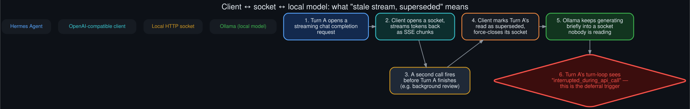

# API/socket connectors: what "stale stream, superseded" actually means

<p align="center">
  
</p>
<p align="center"><sub>The concrete mechanics behind the recurring log line that precedes most interrupted-turn deferrals.</sub></p>

The interrupted-turn deferral path (see the [README](../README.md) and
[`technical_rationale.md`](technical_rationale.md)) is triggered by a specific, recurring log
signature:

```
agent.chat_completion_helpers: Shut down the stale stream's socket to unblock the reader
  (attempt superseded; model=<loaded model>).
```

This doc is about what that line actually describes at the transport level.

> **Correction (round 2):** the "Turn A vs. a second call" framing below has the roles backwards.
> Reading the actual source in
> [`rollouts/background_review_subsystem_deep_dive.md`](rollouts/background_review_subsystem_deep_dive.md)
> shows it's the **background review's own turn** that gets cancelled whenever the next live turn
> starts — never the reverse. The step-by-step sequence immediately below is kept for the
> historical record of how this was originally (incorrectly) reconstructed from log effects alone;
> treat the deep-dive doc as the accurate, source-confirmed account.

## The client talks to a local model over plain HTTP

A locally-loaded model is served over an OpenAI-compatible HTTP API on `localhost`. Hermes Agent's
client opens a streaming chat-completion request the same way it would against any OpenAI-style
endpoint — the difference is only that the "cloud" here is a process on the same machine.
Streaming responses arrive as server-sent-event-style chunks over a long-lived HTTP connection
that stays open for the duration of generation.

## Supersession is a client-side decision, not a server error (original, corrected account below)

Nothing goes wrong on the model-serving side when this happens. The sequence, as originally
reconstructed from the log evidence alone — **see the correction above**:

1. A turn (call it Turn A) opens a streaming request and starts receiving tokens.
2. Before Turn A's generation finishes, a second call fires on the same session — most commonly a
   background review (the skill-library or memory nudge) reusing the same client/session context.
3. The client's request-tracking logic recognizes that Turn A's in-flight read has been
   superseded by the newer call, and deliberately force-closes Turn A's socket to unblock whatever
   was reading from it — this is the "stale stream... attempt superseded" line.
4. The local model itself may keep generating briefly into a socket that's already been closed on
   the client side; that output is simply discarded, not delivered anywhere.
5. Turn A's own turn-loop observes the forced closure and reports
   `reason=interrupted_during_api_call`, which is exactly the flag the post-turn hook checks
   before deciding to auto-pause the goal instead of judging it.

## Why this happens more on one model than others

Nothing about this mechanism is model-specific — any local model can have its stream superseded
this way. What varies is *how often* the collision condition (step 2) occurs, and that's a
function of session behavior, not the socket layer: a model running long goal loops sees far more
background-review nudges fire during its active generations simply because it's *generating* far
more often and for far longer stretches. See the README's per-model comparison and
[`known_unknowns.md`](known_unknowns.md) for what's confirmed versus inferred about why one model
dominates these counts.

## What this doc doesn't claim

This is a description of an observed mechanism, not a claim about the underlying client
implementation's internals beyond what the log lines and turn-outcome reasons directly show. The
exact code path that performs the force-close wasn't traced line-by-line as part of this
diagnosis — the "5-step sequence" above is a reconstruction from observed effects (the log
message, the turn outcome, the timing relative to nudge injection), not a source-verified trace.
