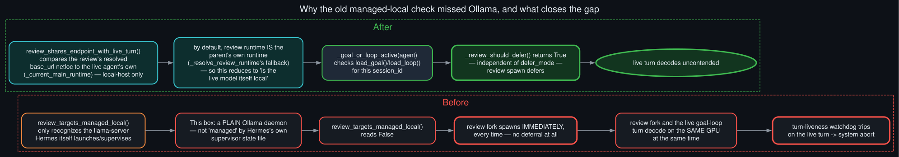

# Background-review contention fix

<p align="center">
  
</p>

`run_agent.py`'s `_review_should_defer(agent, task_cfg)` decides whether a background skill/memory
review should queue for an idle window instead of spawning immediately. Before this fix, it was:

```python
defer_mode(task_cfg) == "auto" and review_targets_managed_local(agent, task_cfg)
```

`review_targets_managed_local` does an exact netloc match against a supervisor state file that
only exists when Hermes itself launched and manages the llama-server the review would hit. On a
box running a plain, independently-managed Ollama daemon — this repo's own real setup, and
probably the most common real-world one — that state file doesn't exist, the function reads
`False` unconditionally, and a review spawns immediately every single time, regardless of
`defer_mode`.

By default (no `auxiliary.background_review.provider/model` override configured, again the common
case), `_resolve_review_runtime`'s "same as parent" fallback means the review runtime *is* the
live agent's own runtime — same provider, same model, same `base_url`. So an immediate spawn on
Ollama means the review fork and the very next live turn (frequently a goal continuation) decode
against the exact same GPU at the same time — precisely the condition that can trip the
turn-liveness watchdog on the live turn, producing the system-issued abort
[`turn_exit_reason_classification`](turn_exit_reason_classification.md) now has to handle
gracefully.

The fix adds `review_idle_queue.review_shares_endpoint_with_live_turn(agent, task_cfg)` — resolve
the review's runtime, resolve the live agent's own runtime (`agent._current_main_runtime()`),
compare netlocs, and require the shared host to be a local one (`localhost`/`127.0.0.1`/etc.) so a
review correctly routed to a different, non-contending cloud model never gets needlessly deferred.
Combined with a new `_goal_or_loop_active(agent)` check (`hermes_cli.goals.load_goal` /
`hermes_cli.loops.load_loop` for the current `session_id`, failing open to `False` on any error),
`_review_should_defer` now also defers whenever a `/goal` or `/loop` is actively driving the
session and the review would land on the same local endpoint — independent of `defer_mode`,
because immediate spawn there always competes with the very next continuation turn regardless of
what the operator configured.
