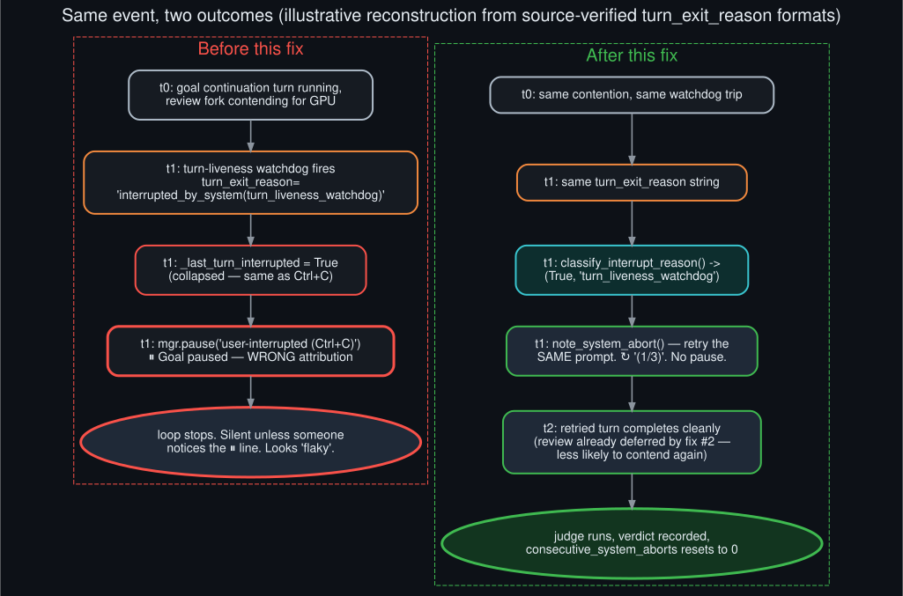

# Before/after timeline

  

This timeline is an **illustrative reconstruction**, not a captured log excerpt — unlike
[`live_verification_evidence`](live_verification_evidence.md), which quotes real `agent.log`
lines from actual runs this session. A genuine turn-liveness-watchdog trip under live GPU
contention wasn't deliberately reproduced (that would mean induced instability on a real,
in-use box); instead this walks the same event through the *before* and *after* code paths using
the exact `turn_exit_reason` string format `agent/turn_iteration_prep.py` is confirmed (by
reading the source directly) to build for a watchdog-issued abort:
`interrupted_by_system(turn_liveness_watchdog)`.

Before the fix: that string sets `self._last_turn_interrupted = True`, the old code path checked
only the bare boolean, and `mgr.pause(reason="user-interrupted (Ctrl+C)")` fired — a message that
actively misdescribes what happened, since no user pressed anything. The loop stops silently
except for that one easy-to-miss `⏸` line, and resuming requires a human to notice and type
`/goal resume`.

After the fix: the same string reaches `classify_interrupt_reason`, which correctly returns
`(True, "turn_liveness_watchdog")`. `note_system_abort` retries the exact prompt that was running
when the watchdog fired, prints a `↻` line naming the real cause and the retry count, and — since
[`background_review_contention_fix`](background_review_contention_fix.md) also reduces how often
this specific contention happens in the first place — the retried turn is less likely to hit the
same watchdog trip again. If it does keep happening, three strikes still falls back to the
original safe pause, just with an accurate reason attached.
