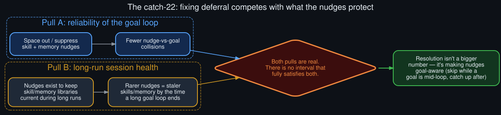

# The catch-22

  

The two pulls behind the deferral behavior, and why no single interval fully satisfies both.

The [root cause](../README.md#root-cause-four-silent-deferral-paths) of the perceived "goal not
firing" behavior is that periodic background-review nudges — the skill-library review, the memory
review — collide with the `/goal` continuation loop and swallow a judge call. The obvious fix
sounds simple: space the nudges out further, or suppress them while a goal is active.

It isn't that simple, and that's the catch-22 this doc is about.

## Pull A: goal-loop reliability

Every nudge collision costs the goal loop one turn of judge latency — sometimes more, if the
nudge itself gets interrupted and retried. Widen the nudge interval, or suppress nudges entirely
while a goal is active, and these collisions become rarer. From the goal loop's point of view,
this is a pure win.

## Pull B: long-run session health

The nudges exist for a reason. A skill-library review keeps the agent's reusable skill files
current with what it's actually learned to do in this session; a memory review keeps its
persistent memory from drifting stale. Both are *more* valuable, not less, in exactly the
sessions where `/goal` tends to run longest — a 40-turn autonomous loop produces far more
skill-worthy and memory-worthy material than a three-turn back-and-forth.

Widen the nudge interval and you get fewer collisions, but also a longer session with a stale
skill library and stale memory by the time the goal finishes — potentially the entire multi-hour
loop's accumulated context never gets distilled into anything durable.

## Why there's no clean number

Any fixed interval is a compromise between these two pulls, and the two pulls scale in opposite
directions with the same variable: how long the goal loop runs. A short goal loop never sees a
collision regardless of the interval. A long goal loop — the exact case `/goal` is *for* — sees
more collisions the more valuable the nudges would have been if they'd fired.

## Where this actually points

The tension isn't resolved by a bigger or smaller number — it's resolved by making the nudge
scheduler *goal-aware*: skip firing a nudge while a goal continuation is in flight, but don't
drop the tick — queue it to fire on the next turn boundary where the hook isn't mid-judgment.
That preserves both pulls: nudges still happen, on a schedule that respects their own value, and
they stop being able to eat a judge call. See
[`future_directions.md`](future_directions.md) for where this sits on a longer roadmap, and
[`technical_rationale.md`](technical_rationale.md) for why the *current* behavior — nudges simply
winning the collision — was the simpler thing to ship first.
