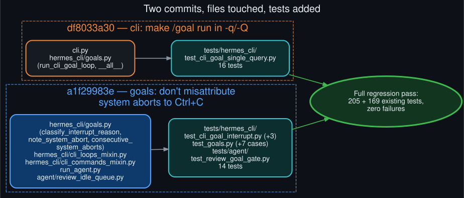

# Commit and test map

  

Two local commits in `~/.hermes/hermes-agent` (a real clone tracking `NousResearch/hermes-agent`;
see [`fork_and_publish_pathway`](fork_and_publish_pathway.md) for how they got published):

**`df8033a30` — cli: make /goal actually run in -q/-Q single-query mode.** Touches `cli.py`
(`_looks_like_goal_command`, `_run_cli_goal_command_q`, wiring into `_run_quiet_single_query` and
`_run_single_query_mode`) and `hermes_cli/goals.py` (`run_cli_goal_loop`, `__all__`). New test
file `tests/hermes_cli/test_cli_goal_single_query.py`, 16 tests: the loop driver's own behavior
(drives to done, pauses on interrupt, stops on empty response, respects the turn budget),
`_looks_like_goal_command`'s detection table, and — the test that directly reproduces and closes
the bug — a stubbed `HermesCLI` asserting `judge_goal` actually gets called through the real
single-query wiring, plus a regression guard confirming `HERMES_KANBAN_GOAL_MODE=1` still bypasses
the new path entirely.

**`a1f29983e` — goals: don't misattribute system-issued turn aborts to Ctrl+C.** Touches
`hermes_cli/goals.py` (`classify_interrupt_reason`, `GoalState.consecutive_system_aborts`,
`GoalManager.note_system_abort`, the reset-on-success line in `evaluate_after_turn`),
`hermes_cli/cli_loops_mixin.py` (both `_maybe_continue_goal_after_turn` and its `/loop` sibling
`_maybe_complete_loop_tick_after_turn`), `hermes_cli/cli_commands_mixin.py` (`_kick_goal` now
tracks `_last_goal_prompt_in_flight`), `run_agent.py` (`_review_should_defer`,
`_goal_or_loop_active`), and `agent/review_idle_queue.py`
(`review_shares_endpoint_with_live_turn`). Extends `tests/hermes_cli/test_cli_goal_interrupt.py`
(+3: genuine-interrupt non-regression, retry-without-pausing, cap-and-fall-back,
reset-on-success) and `tests/hermes_cli/test_goals.py` (+7 parametrized
`classify_interrupt_reason` cases), and a new `tests/agent/test_review_goal_gate.py` (14 tests
covering the defer gate's new and unchanged conditions, plus fail-open behavior on error).

Both commits carry `Co-Authored-By: Claude Sonnet 5 <noreply@anthropic.com>` per the session's
attribution convention. Full regression pass across the directly-touched and adjacent existing
test modules — 205 tests in one batch, 169 in a second covering `test_cli_goal_kick_prompt.py`,
`test_quiet_single_query.py`, `test_single_query_exit_contract.py`, `test_loops.py`, and the
gateway-side goal tests — all passed unchanged.
