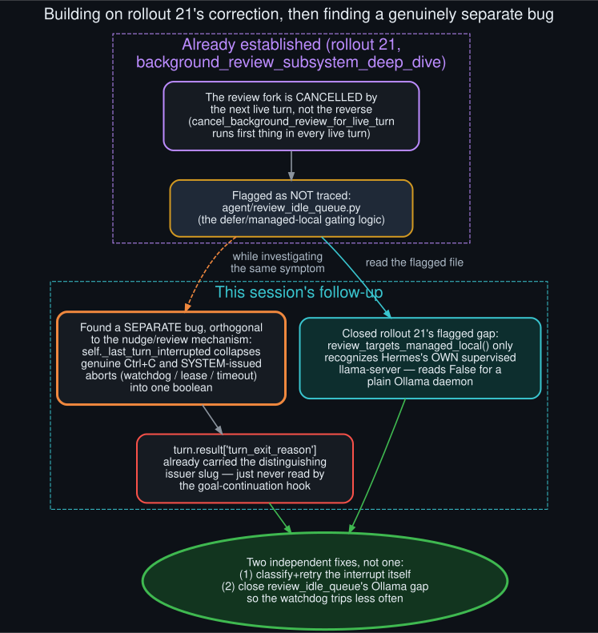

# Corrected mechanism

  

This repo's rollout 21 (`docs/rollouts/background_review_subsystem_deep_dive.md`) already
corrected the original diagnosis's framing of cause #4: the skill/memory nudge is not a turn
racing the goal continuation prompt for a slot in `self._pending_input` — it's a **separate
forked `AIAgent`** replaying a conversation snapshot, and it is the review fork's own stream that
gets cancelled the instant the next live turn starts (`cancel_background_review_for_live_turn`,
called first thing in every `run_conversation`). That correction stands unchanged.

Rollout 21 explicitly flagged what it hadn't traced: `agent/review_idle_queue.py` — the module
that decides whether a review should be deferred instead of spawned immediately. This session
read that file and found the actual gap: `review_targets_managed_local()` only recognizes the
llama-server Hermes itself launches and supervises via its own state file. A self-hosted-but-
unmanaged backend — a plain Ollama daemon, the common real-world setup — reads `False` there even
though, by default, the review runtime *is* the parent's own runtime (`_resolve_review_runtime`'s
"same as parent" fallback), so it contends for the exact same GPU. Closing this gap
(`review_shares_endpoint_with_live_turn` + a goal/loop-awareness check) is one of this session's
two fixes.

The second, and the more surprising one, turned out to be unrelated to nudges or reviews at all.
Investigating why the goal loop kept auto-pausing led to `_maybe_continue_goal_after_turn`'s
interrupt handling: `self._last_turn_interrupted` is a single boolean, set identically whether the
turn was cancelled by a genuine user Ctrl+C or by a system-issued abort — a turn-liveness-watchdog
stall, a session-lease loss, a timeout. Both collapse to the same `mgr.pause("user-interrupted
(Ctrl+C)")` call, misattributing a transient system hiccup to user intent. The data needed to tell
them apart, `turn.result["turn_exit_reason"]`, was already being computed and stored on
`self._last_turn_result` before the post-turn hooks ran — it just wasn't being read.

So this addendum is really two fixes for two different bugs that happened to produce the same
symptom (a goal loop that "just stops"): one closes a gap rollout 21 flagged but didn't chase down,
the other is a fresh finding this session made while looking at the same overall problem from a
different angle — the interrupt-handling code path, not the nudge/review subsystem.
