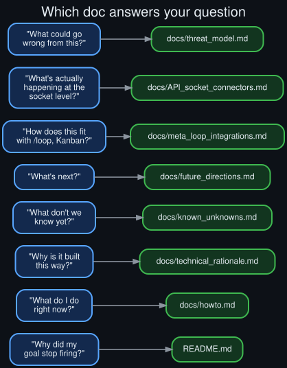

# FAQ

  

Short answers here; the linked doc has the full version.

### Is the judge model broken?

No. See the [README](../README.md#the-judge-is-not-the-problem) — it resolves correctly and
consistently whenever it's actually called. The issue is upstream of the judge: a post-turn hook
sometimes decides not to call it at all.

### Why did my goal stop firing?

Almost certainly one of four things: the turn was interrupted, the response came back empty, a
real user message was already queued, or a periodic skill/memory nudge landed on that turn
instead of a goal continuation. Full detail in the
[README](../README.md#root-cause-four-silent-deferral-paths); step-by-step diagnosis in
[`howto.md`](howto.md).

### What should I do right now if my loop looks stuck?

Check `/goal status` first. If it's paused, `/goal resume`. If it's active and under budget,
give it one more turn before assuming anything's wrong — most deferrals resolve themselves within
a turn or two. Full checklist: [`howto.md`](howto.md).

### Is this a bug I should report?

The deferral behavior is by design (see [`technical_rationale.md`](technical_rationale.md)), so
it's not a bug in the sense of broken code. Whether the *design* should change — e.g., to make
nudges goal-aware, or to log deferrals explicitly — is a reasonable thing to raise upstream; see
[`future_directions.md`](future_directions.md) for the specific proposals this repo lands on.

### Does this affect every model, or just one?

Every model *can* hit these deferral paths, but one specific loaded model accounted for the large
majority of interruptions and stalls in the logs checked here — see the README's comparison table
and [`known_unknowns.md`](known_unknowns.md) for what's confirmed versus still open about why.

### Does this apply to `/loop`, Kanban cards, or heartbeat too?

Only `/goal`'s own hook was audited here. Kanban goal-mode cards borrow `/goal`'s engine directly
and plausibly share these paths; `/loop` and heartbeat have their own, separately-shaped logic
that wasn't traced as part of this diagnosis. See
[`meta_loop_integrations.md`](meta_loop_integrations.md).

### Is this a security issue?

No — see [`threat_model.md`](threat_model.md) for why this is framed as an operational/reliability
question, not a security one. There's no adversary or trust boundary involved anywhere in this
diagnosis.

### Why publish this as a whole repo instead of just a gist or a forum post?

See [`why_this_repo_exists.md`](why_this_repo_exists.md) — short version: it's a complete, sourced
diagnosis with reusable evidence and diagrams, meant to stand on its own for anyone who hits the
same behavior.
