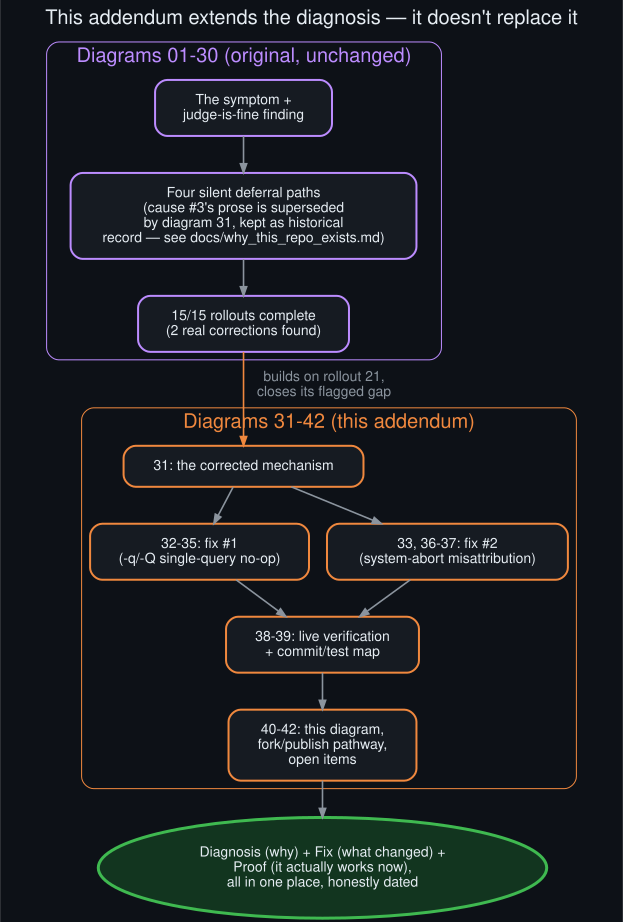

# Fix vs. diagnosis: how this addendum relates to the original repo

  

[`why_this_repo_exists.md`](why_this_repo_exists.md) originally framed this repo as documentation,
not a patch — a deliberate choice at the time, since the original 30 diagrams were a diagnosis
with mitigation *proposals*, none of them applied. This addendum changes that: the mitigations
weren't just proposed this time, they were implemented, tested, verified live, and published as a
real diff (see [`fork_and_publish_pathway`](fork_and_publish_pathway.md)).

Nothing in diagrams 01–30 needed rewriting to accommodate that. The symptom description, the
finding that the judge itself was healthy, the original four-deferral-paths framing (superseded in
its *mechanism* by rollout 21 and now further refined by
[`corrected_mechanism`](corrected_mechanism.md), but accurate at the *effect* level throughout),
and the completed 15/15 rollouts ledger all stand as the historical record of how this was
diagnosed. This addendum picks up exactly where the mitigation-proposals section left off: cause
#1 (misattributed auto-pause) and the GPU-contention root cause rollout 21 flagged but didn't trace
are now real, tested code changes rather than open questions.

The numbering makes the relationship legible without needing this doc: 01–15 are the core
diagnosis with one paired diagram per doc, 16–30 are the 15 completed rollouts (deeper audits,
corrections, and design proposals informed by round-over-round findings), and 31–42 are this
addendum — diagnosis and rollouts inform the fix, the fix doesn't retroactively rewrite them.
