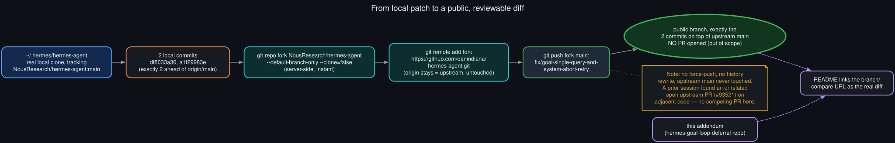

# Fork and publish pathway

<p align="center">
  
</p>

The two commits described in [`commit_and_test_map`](commit_and_test_map.md) started as ordinary
local commits on `main` in `~/.hermes/hermes-agent`, a real clone tracking
`NousResearch/hermes-agent`. Publishing the actual diff — not just describing it in prose — used
GitHub's standard fork workflow rather than anything unusual:

```bash
gh repo fork NousResearch/hermes-agent --default-branch-only --clone=false
git remote add fork https://github.com/danindiana/hermes-agent.git
git push fork main:fix/goal-single-query-and-system-abort-retry
```

`gh repo fork` with an explicit repository argument creates the fork server-side (instant — no
data transfer for the fork itself) without touching the local clone's remotes. Adding a
separately-named `fork` remote, rather than letting `gh` repoint `origin`, keeps `origin` pointing
at the real upstream throughout — nothing about the existing clone's relationship to
`NousResearch/hermes-agent` changed. The push itself only has to transfer the two new commits'
delta (the local clone was exactly two commits ahead of `origin/main` at push time), landing them
on a plain feature branch rather than the fork's own `main`.

No pull request was opened against `NousResearch/hermes-agent` — that's deliberately out of scope
here. A prior session (see the original diagnosis repo's own investigation notes) had already
found an unrelated open upstream PR, #93521, touching adjacent goal-continuation code; this
addendum's fixes don't compete with or depend on it. The branch exists so the actual diff is
inspectable by anyone, independent of whether or when it's proposed upstream.
