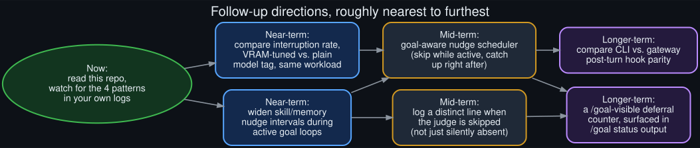

# Future directions

  

Roughly nearest-term to furthest-out, each step building on the one before it.

Concrete follow-ups, not applied in this repo — this is a diagnosis and a proposal set, not a
patch (see [`why_this_repo_exists.md`](why_this_repo_exists.md) for why).

## Now

Read this repo, and watch your own `agent.log` for the four patterns described in the
[README](../README.md) and detailed in [`howto.md`](howto.md). Most of the value here is
recognition — knowing that a paused-looking goal loop is very likely one of four specific,
well-understood things, not a mystery.

## Near-term: two measurements

1. **Compare interruption rate, VRAM-tuned vs. plain model tag, same workload.** Run an
   equivalent long goal loop on both variants of the same base model and compare
   `interrupted_during_api_call` and reasoning-only-stall counts directly. This would confirm or
   rule out the leading hypothesis in [`known_unknowns.md`](known_unknowns.md).
2. **Widen skill/memory nudge intervals during active goal loops**, as a cheap, reversible
   mitigation — not a fix, but a way to reduce how often [`catch22.md`](catch22.md)'s collision
   actually fires while a more durable fix is worked out.

## Mid-term: two mechanism changes

1. **A goal-aware nudge scheduler.** Rather than a fixed interval, have the nudge scheduler check
   whether a goal continuation is in flight and, if so, defer its own tick to the next available
   turn boundary instead of firing into the middle of a goal turn. This is the resolution
   [`catch22.md`](catch22.md) points toward — it doesn't reduce how often nudges run, it just
   stops them from colliding.
2. **A distinct log line when the judge is skipped**, for each of the four deferral paths, rather
   than the current behavior of simply not logging a judge call. This alone would have made this
   entire diagnosis a five-minute log-grep instead of a multi-session investigation.

## Longer-term: two visibility features

1. **A deferral counter surfaced in `/goal status` output** — e.g. "3 turns deferred (2
   interrupted, 1 nudge collision)" — so a user watching a long-running goal has direct visibility
   into how often the loop is silently skipping judgment, without needing to read raw logs.
2. **A direct comparison of the CLI and gateway post-turn hooks' deferral behavior**, closing the
   open question in [`known_unknowns.md`](known_unknowns.md) about whether both surfaces share the
   same four gaps or diverge in some way not yet observed.

None of these require rethinking the fail-open design documented in
[`technical_rationale.md`](technical_rationale.md) — they're additive: more visibility, better
scheduling, same underlying safety guarantees.
