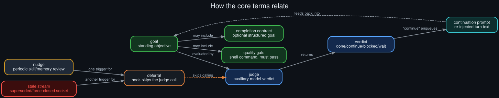

# Glossary

  

How the core terms relate to each other, not just what each one means in isolation.

**goal** — a standing objective set with `/goal <text>`, persisted for the session and re-judged
after every turn until it resolves or the turn budget is exhausted.

**completion contract** — an optional, structured expansion of a goal into five fields
(`outcome`, `verification`, `constraints`, `boundaries`, `stop_when`), used to make judging
stricter and more concrete than judging free-form prose.

**quality gate** — an optional, deterministic shell command attached to a goal that must exit `0`
before the judge is even consulted; a red gate is treated as automatic evidence the goal isn't
done, skipping the judge call for that turn (a different, intentional kind of "skip" than the four
deferral paths this repo documents — see the distinction below).

**judge** — the auxiliary model that evaluates a goal after each turn. Deliberately a separate,
usually faster/cheaper model from the one doing the actual work, configured independently.

**verdict** — the judge's structured output: `done`, `continue`, `blocked`, or `wait`, each with a
one-sentence rationale.

**continuation prompt** — the text re-injected into the session when the judge returns `continue`,
functionally identical to the user typing "keep going" but generated automatically.

**deferral** — this repo's central subject: any of the four conditions under which the post-turn
hook decides *not* to call the judge at all for a given turn, distinct from the judge being
*called* and returning a verdict. A deferral produces no verdict, whereas a quality-gate failure
or a `blocked` verdict are both verdicts (or verdict-equivalents) in their own right.

**nudge** — a periodic, unrelated maintenance turn (skill-library review, memory review) that
Hermes injects into a session on its own interval, independent of any goal. One of the four
deferral triggers when it collides with an active goal loop.

**stale stream** — the log signature for a client-side forced socket closure when a newer request
supersedes an in-flight one on the same session; see
[`API_socket_connectors.md`](API_socket_connectors.md) for the full mechanism. The resulting
`interrupted_during_api_call` outcome is what the interrupted-turn deferral path checks for.

**fail-open** — the general design philosophy behind every deferral path documented here: when
something's ambiguous or has gone wrong, the loop errs toward *not* prematurely judging progress,
rather than risking a false verdict. See [`technical_rationale.md`](technical_rationale.md).

**turn budget** — the hard backstop (`goals.max_turns`, default 20) that pauses a goal
unconditionally once enough continuation turns have run, regardless of how many were deferred
along the way.
