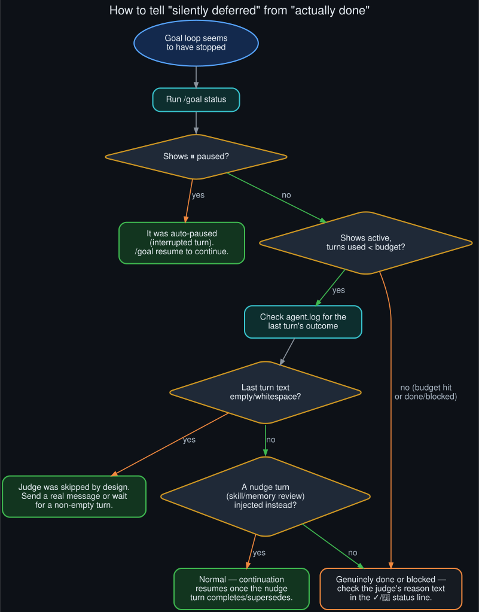

# How to tell "silently deferred" from "actually done"

<p align="center">
  
</p>
<p align="center"><sub>The four checks to run, in order, before assuming the goal loop is broken.</sub></p>

This is the practical companion to the [README](../README.md)'s diagnosis: concrete steps for
figuring out *which* of the four deferral paths fired, the next time a `/goal` loop looks like
it's stopped.

## Step 1 — check `/goal status`

```
/goal status
```

If it shows `⏸ Goal paused`, the loop hit the **interrupted-turn** path: the last turn was
cancelled or its stream was force-closed, so the post-turn hook auto-paused the goal instead of
judging it. This is fully recoverable:

```
/goal resume
```

resets the turn counter and picks the loop back up. If it happens repeatedly on the same session,
see [`API_socket_connectors.md`](API_socket_connectors.md) for what's actually causing the
interruption.

## Step 2 — check turns used vs. budget

If `/goal status` shows the goal as active with turns used below the configured budget (default
20), the loop hasn't hit its backstop yet — something is deferring the judge call, not stopping
the loop outright. Move to Step 3.

If turns used has hit the budget, that's a normal, logged pause — `⏸ Goal paused — N/N turns
used` — not a deferral. `/goal resume` to keep going, or `/goal clear` to end it.

## Step 3 — check the last turn's response in `agent.log`

Find the most recent `conversation_loop: Turn ended` line for the session. If `response_len=0` or
the response is pure whitespace, that's the **empty-response** path — skipped by design, no
judge call, no pause message either. The fix here is usually just letting the next turn run
normally; if this repeats, it's worth checking whether the model is dropping streams entirely
(see [`known_unknowns.md`](known_unknowns.md)).

## Step 4 — check whether the next injected turn was a nudge

Look at the `turn_context` line immediately after the turn that should have been judged. If its
message starts with something like `Review the conversation above and update the skill
library...` or a memory-review nudge prompt, that's the **background-review-nudge** path — see
[`docs/catch22.md`](catch22.md) for why this collision happens and
[`docs/meta_loop_integrations.md`](meta_loop_integrations.md) for how nudges relate to `/goal`'s
own machinery. The continuation resumes automatically once the nudge turn completes or gets
superseded — no action needed, just expect a one-turn lag.

## Step 5 — if none of the above, it's a real verdict

If the loop genuinely shows `✓ Goal achieved` or `🚫 Goal judged unachievable`, read the reason
text in that status line — it's the judge's actual rationale, not a generic message. If the
verdict looks wrong (a false "done" on unfinished work, or a false "blocked" on something that's
actually fine), re-set the goal with more specific text, or add a
[completion contract](https://github.com/danindiana/hermes-goal-loop-deferral#) field —
`verify:` / `constraints:` / `boundaries:` — so the judge has something concrete to check against
instead of prose.

## Quick reference

| Symptom | Cause | Fix |
|---|---|---|
| `⏸ Goal paused`, no obvious reason | Interrupted turn | `/goal resume` |
| Active, under budget, no recent judge log line | Empty response OR nudge collision | Wait one turn, or check `agent.log` |
| `✓`/`🚫` but you disagree | Judge misread the goal text | `/goal <more specific text>` or add a contract |
| Turns used = budget | Normal backstop, not deferral | `/goal resume` or `/goal clear` |
