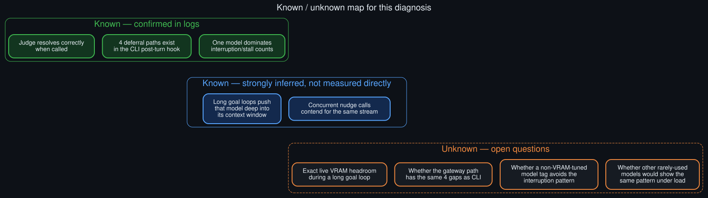

# Known unknowns

  

What the log evidence actually establishes, what it strongly implies, and what it leaves genuinely open.

This diagnosis is sourced entirely from real logs, but that doesn't mean every claim in it carries
the same weight. This doc separates what's directly confirmed from what's inferred but plausible,
and lists the open questions the current evidence can't settle.

## Confirmed directly in logs

- The auxiliary judge model resolves correctly and consistently when it's actually called —
  dozens of verdicts logged across multiple days, each with a substantive, specific rationale.
- The four deferral paths exist as described in the CLI's post-turn hook source, and at least the
  interrupted-turn path and the nudge-collision path were each caught in the act in real log
  output, not just read out of source code.
- One specific loaded model accounts for the overwhelming majority of both interrupted-turn and
  reasoning-only-stall events across the log window checked, far above every other model observed
  in the same environment over the same period.

## Strongly inferred, not measured directly

- The dominant model's long goal-loop sessions run deep into its configured context window
  (observed: well over half of a large context budget, with prompt-cache hit rates in the
  mid-to-high 90s) — consistent with, but not directly proven to *cause*, the stream
  interruptions. Correlation was observed; causation was not isolated with a controlled test.
- Concurrent background-review calls against the same model plausibly contend for the same
  stream/connection as an in-flight goal continuation, based on the "stale stream... attempt
  superseded" log line appearing right where a nudge collides with a goal turn — see
  [`API_socket_connectors.md`](API_socket_connectors.md) for the mechanism this implies, but the
  exact resource being contended (socket, GPU scheduling slot, model-serving queue) wasn't
  isolated.

## Genuinely open questions

- **Exact live VRAM headroom during a long goal loop.** The theory that a VRAM-tuned model tag
  leaves less slack under sustained long-context load is plausible but wasn't confirmed against
  live `nvidia-smi`/`ollama ps` output captured *during* an active long-running goal session.
- ~~**Whether the gateway code path shares the same four deferral gaps as the CLI path.**~~
  **Closed** by the [rollouts](ROLLOUTS.md) process — see
  [`rollouts/cli_gateway_hook_parity_audit.md`](rollouts/cli_gateway_hook_parity_audit.md) and its
  two follow-ups. Short answer: two rows share mechanism, one is a confirmed real difference
  (gateway judges partial output from interrupted turns), one achieves the same guarantee by a
  different mechanism (FIFO ordering vs. a pre-emptive skip).
- **Whether a non-VRAM-tuned variant of the same base model would show a meaningfully lower
  interruption rate on the identical workload.** No side-by-side comparison was run; this is a
  hypothesis, not a result. A runnable protocol for testing it now exists:
  [`rollouts/vram_tag_comparison_protocol.md`](rollouts/vram_tag_comparison_protocol.md).
- **Whether other, less-frequently-loaded models would show the same pattern under equivalent
  sustained load.** The comparison in the README is a count over *observed* usage, not a
  controlled experiment — a rarely-loaded model with a low raw count could still have a high rate
  if it were used as heavily as the dominant one.
- **Whether heartbeat's idle-poll can collide with an in-flight goal judge call.** Plausible on
  timing grounds (a 5-second poll against a 10–40 second synchronous judge call) but not confirmed
  by tracing the relevant session-busy flags — see
  [`rollouts/heartbeat_collision_check.md`](rollouts/heartbeat_collision_check.md).

## Why this matters

Treating "strongly inferred" claims with the same confidence as "confirmed" ones is exactly the
kind of overclaiming this repo is trying to avoid by sourcing everything to real logs in the first
place. See [`future_directions.md`](future_directions.md) for the specific follow-up experiments
that would close each of these gaps.
