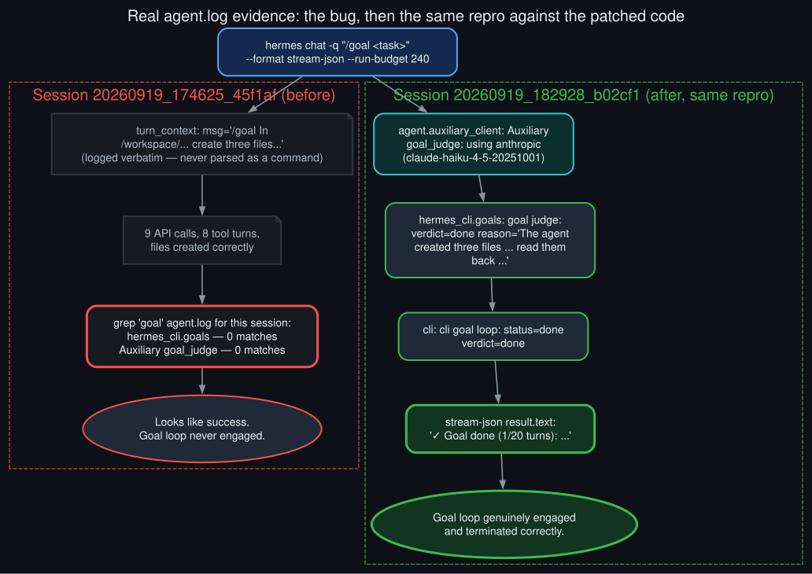

# Live verification evidence

<p align="center">
  
</p>

Unlike [`before_after_timeline`](before_after_timeline.md), everything here is a real, captured
log excerpt from two actual `hermes chat -q` invocations against the same box, using the exact
same repro prompt shape, run before and after the fix landed.

**Before** (session `20260919_174625_45f1af`): `hermes chat -q "/goal In /workspace/..., create
three files a.txt, b.txt, c.txt each containing one distinct real fact about Saturn..." --format
stream-json --run-budget 240`. The turn ran, did the task correctly (files created, facts
accurate, verified via `read_file`), and exited 0 — a result that looks like complete success.
Grepping `agent.log` for that exact session id tells a different story:

```
agent.turn_context: conversation turn: session=20260919_174625_45f1af ... msg='/goal In /workspace/...'
```

— the `/goal` text logged verbatim as an ordinary chat message — and then **zero** lines matching
`hermes_cli.goals` or `Auxiliary goal_judge` anywhere in that session, while the interactive
session running on the same box that same afternoon had 25+ real judge calls logged right up
until minutes before this test.

**After** (session `20260919_182928_b02cf1`, same repro, Jupiter facts instead of Saturn): the
`agent.log` for this session shows

```
agent.auxiliary_client: Auxiliary goal_judge: using anthropic (claude-haiku-4-5-20251001)
hermes_cli.goals: goal judge: verdict=done reason=The agent created three files (a.txt, b.txt, c.txt) ...
cli: cli goal loop: status=done verdict=done reason=The agent created three files ...
```

and the stream-json output's terminal `result` record reads `"✓ Goal done (1/20 turns): ..."`
instead of a plain chat reply. Same task shape, same invocation flags, same box — the only
difference is the two commits in between.
