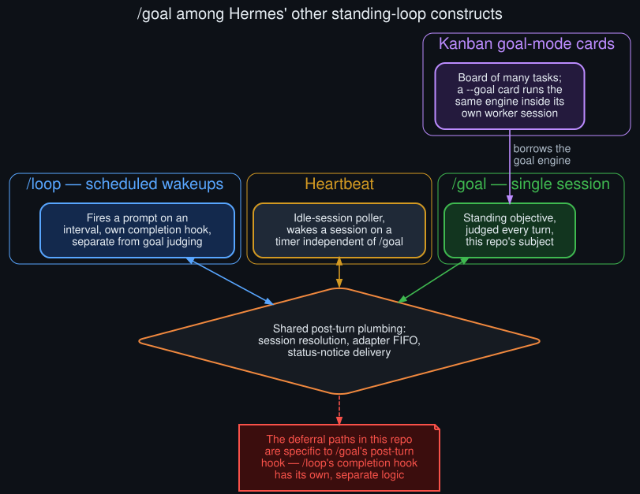

# Meta: how `/goal` fits among Hermes' other standing-loop constructs

  

Four related-but-distinct standing-loop mechanisms, and where their plumbing overlaps.

This diagnosis is scoped tightly to `/goal`'s post-turn hook. Hermes Agent has at least three
other constructs that keep a session working without a user re-prompting every turn, and it's
worth being explicit about how they relate — both so this repo's findings aren't over-generalized
to features they don't cover, and because some of the shared plumbing is relevant context.

## `/goal` — the subject of this repo

A single-session standing objective, judged after every turn by an auxiliary model, looping via a
re-injected continuation prompt until the judge says `done`, `blocked`, or the turn budget is
exhausted. Everything in this repo is about `/goal`'s specific post-turn hook and its four
deferral paths.

## `/loop` — scheduled wakeups, a different mechanism entirely

`/loop` fires a prompt on a time interval rather than judging turn-by-turn progress toward an
objective. It has its own completion hook (`_maybe_complete_loop_tick_after_turn` in the CLI,
mirroring `/goal`'s shape but operating on a `LOOP_COMPLETE` marker and an optional `--until`
judge rather than a persistent goal verdict). **The deferral paths documented in this repo are
specific to `/goal`'s hook** — `/loop`'s completion hook was not audited as part of this
diagnosis and may or may not share the same gaps; see [`known_unknowns.md`](known_unknowns.md).

## Kanban goal-mode cards — the engine, borrowed, not the board

A Kanban card created with `--goal` runs the *same* Ralph-style continuation engine as `/goal`,
but scoped inside that one card's own worker session. It borrows `/goal`'s engine wholesale,
which means the deferral paths documented here plausibly apply identically to a goal-mode card's
worker session — worth confirming directly rather than assuming, since a worker session's turn
shape (no interactive user, no CLI-specific queue-peeking) may not trigger every path the same
way. The board itself — cards, dependencies, assignees — is unrelated machinery.

> **Correction (round 2):** confirmed directly against source in
> [`rollouts/kanban_goal_mode_worker_session_audit.md`](rollouts/kanban_goal_mode_worker_session_audit.md)
> — and the assumption above doesn't hold. Kanban goal-mode judges once, at handoff time, via a
> worker-triggered check (`_goal_mode_handoff_rejection`), not via `GoalManager`'s automatic
> per-turn hook. The four deferral paths in this repo don't apply to Kanban worker sessions at
> all — there's no post-turn hook for a turn to be deferred from in the first place.

## Heartbeat — idle-session polling, orthogonal

Heartbeat wakes an idle session on its own timer, independent of both `/goal` and `/loop`. It
doesn't interact with goal judging directly, but it shares the same category of "periodic
mechanism that can inject a turn into a session that might also be running a goal loop" as the
skill-library and memory nudges this repo's root cause centers on — worth keeping in mind as a
similar-shaped risk, even though it wasn't observed causing a deferral in the logs checked here.

## Shared plumbing

All four constructs go through broadly similar post-turn infrastructure — session resolution, the
adapter FIFO for queuing injected messages, and status-notice delivery timed to land after the
visible response. This shared plumbing is *not* itself a source of the deferral behavior; the
deferral logic lives specifically in `/goal`'s own hook, not in the shared infrastructure it sits
on top of.
