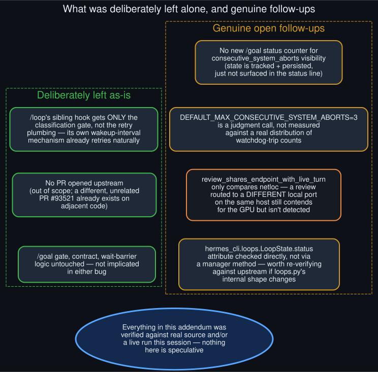

# Open items and follow-ups

  

**Deliberately left alone.** `/loop`'s sibling hook (`_maybe_complete_loop_tick_after_turn`) got
only the classification gate — recognizing a system-issued abort and not misattributing it to
Ctrl+C — without the prompt-replay machinery `/goal` needed, because `/loop` already has its own
wakeup-interval scheduler that will naturally retry on its next scheduled fire; building a second
retry mechanism on top would be redundant. `/goal`'s gate/contract/wait-barrier logic is untouched
throughout both commits — neither bug lived there, and there was no reason to touch code that
wasn't implicated. No PR was opened upstream (see
[`fork_and_publish_pathway`](fork_and_publish_pathway.md)).

**Genuine open follow-ups, not addressed here:**

- `consecutive_system_aborts` is tracked and persisted on `GoalState` but not yet surfaced in
  `/goal status`'s output — an operator watching a long-running goal has no visibility into "this
  has silently retried twice" short of reading `agent.log` directly.
- `DEFAULT_MAX_CONSECUTIVE_SYSTEM_ABORTS = 3` is a judgment call, not something measured against a
  real distribution of watchdog-trip counts the way the original diagnosis's model-comparison table
  (diagram 04) was — a reasonable starting point, not a tuned value.
- `review_shares_endpoint_with_live_turn` compares only the resolved `base_url` netloc. A review
  explicitly routed to a *different* local port on the same host (a second local inference server)
  would still contend for the same GPU without being detected as sharing an endpoint — an edge case
  outside what this fix's default-unconfigured scenario covers.
- The new `_goal_or_loop_active` check reads `hermes_cli.loops.LoopState.status` directly rather
  than through a manager-level method; worth re-verifying against upstream if that module's
  internal shape changes in a future Hermes release.

Everything else in this addendum — the classification logic, the retry/cap behavior, the review
gate's new condition, and the single-query loop driver — was verified against real source this
session and, where practical, against a real live run. Nothing here is speculative.
