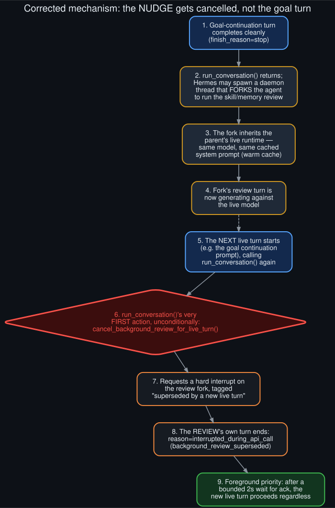

# Rollout: background-review subsystem deep dive

<p align="center">
  
</p>
<p align="center"><sub>Round 2, rollout 1 of 5 — see <a href="../ROLLOUTS.md">ROLLOUTS.md</a> for the full ledger.</sub></p>

**Extends:** round 1 finding (a) — the "4 deferral paths" framing simplifies what's actually a
race with a separate subsystem. This rollout reads that subsystem's own source directly
(`agent/background_review.py` and its caller in `agent/turn_facade.py`) instead of inferring its
behavior from log effects, and **corrects an error** in
[`../API_socket_connectors.md`](../API_socket_connectors.md) along the way.

## What the module actually is

Its own docstring states the design plainly: *"Background memory/skill review — fork the agent to
evaluate the turn. After every turn `AIAgent.run_conversation` may spawn a daemon thread that
replays the conversation snapshot in a forked `AIAgent`... The fork inherits the parent's live
runtime (provider, model, credentials, cached system prompt) so it hits the same prefix cache."*

Concretely: the skill-library and memory nudges aren't separate turns injected into the same
conversation the way a goal continuation prompt is — they're a **full forked agent instance**,
replaying a snapshot of the conversation, routed by default to the **same live model** specifically
so it reuses the warm prompt cache rather than paying a cold-cache penalty on a second model.

## The actual cancellation mechanism — and the correction

`agent/turn_facade.py`'s `run_conversation()` — the entry point for *every* live turn, including a
goal continuation — calls `cancel_background_review_for_live_turn(self)` as its literal first
action, before anything else runs:

```python
from agent.background_review import cancel_background_review_for_live_turn
cancel_background_review_for_live_turn(self)
```

That function requests a hard interrupt on any in-flight review fork, tagged
`"superseded by a new live turn"` (`tool_reason="background review superseded"` — the exact string
that appears in the log evidence throughout this repo), waits up to 2 seconds for the fork to
acknowledge, and then **lets the new live turn proceed regardless** — foreground priority is
absolute; a wedged review can delay a live turn by at most 2 seconds, never block it.

**This means the roles in [`../API_socket_connectors.md`](../API_socket_connectors.md) were
backwards.** That doc described a hypothetical "Turn A" (the goal continuation) as the one that
gets its stream force-closed by a second, colliding call. Reading the actual source shows the
opposite: the **background review's own turn** is the one that gets cancelled, every time,
whenever the *next* live turn (frequently the goal continuation prompt) is ready to start. The
review never wins a race against a live turn — it always loses, by design.

## Reconciling this with the original log evidence

Re-reading the original sequence with this correction in hand, it's fully consistent:

```
14:13:55  Turn ended: reason=text_response ...              <- goal-continuation turn finished cleanly
14:13:55  turn_context ...msg='Review the conversation...'  <- background review fork starts
14:13:55  auxiliary_client: using main provider (local model) <- fork inherits live model, as documented
14:14:01  Shut down the stale stream's socket ...            <- the REVIEW's own stream, cancelled
14:14:01  Turn ended: reason=interrupted_during_api_call
          (background_review_superseded)                    <- the REVIEW's turn outcome, not the goal turn's
14:14:01  turn_context ...msg='[Continuing toward your standing goal]...' <- the NEW live turn that triggered the cancel
```

The goal-continuation turn that started at 14:13:55 in the last line isn't resuming *after* being
interrupted — it's the live turn *whose own start* triggered the cancellation one line above it.

## What this changes in the rest of the repo

- [`../API_socket_connectors.md`](../API_socket_connectors.md) now carries a correction note at
  its top pointing here as the source-confirmed account.
- The README's and [`../technical_rationale.md`](../technical_rationale.md)'s description of the
  nudge-collision deferral path is still accurate at the *effect* level (a judge call slips by one
  turn when a nudge collides) — only the underlying mechanism needed correcting, not the observed
  behavior.
- [`goal_aware_nudge_scheduler_design`](goal_aware_nudge_scheduler_design.md) (round 1) proposed
  checking "is a goal turn in flight" before firing a nudge. This deep dive shows that check
  already effectively exists, just inverted and reactive: the *system* cancels a review once a
  live turn starts, rather than a scheduler proactively avoiding the collision beforehand. The
  round 1 proposal is still worth having — proactive avoidance wastes less of the review fork's
  work than starting it and cancelling it 6 seconds later — but it's a refinement of existing
  behavior, not a fix for a total gap.

## What wasn't traced

This deep dive read the cancellation and forking mechanics; it didn't read
`agent/review_idle_queue.py` (imported in `turn_facade.py` as `_review_queue`, visible in the
excerpt above) or the interval-scheduling logic itself (`_skill_nudge_interval` /
`_memory_nudge_interval`, referenced in `agent/agent_init.py` and `agent/turn_finalizer.py` per
earlier reading this session) — that's what actually decides a nudge is *due* in the first place,
which is the piece [`goal_aware_nudge_scheduler_design`](goal_aware_nudge_scheduler_design.md)
would need to modify. A natural next audit, not done here.
