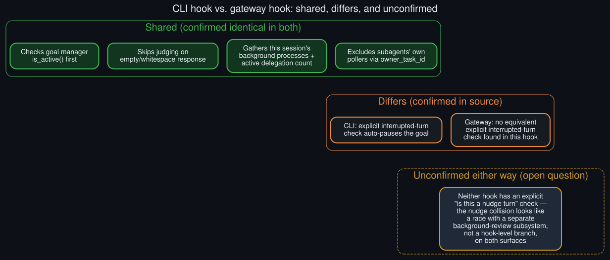

# Rollout: CLI vs. gateway hook parity audit

  

Round 1, rollout 2 of 5 — see <a href="../ROLLOUTS.md">ROLLOUTS.md</a> for the full ledger.

**Extends:** the open question in [`../known_unknowns.md`](../known_unknowns.md) — "whether the
gateway path has the same 4 gaps as CLI." The core diagnosis in this repo was built entirely from
CLI-surface logs; this rollout reads the gateway's own post-turn hook side by side with the CLI's
to see how much of that diagnosis actually transfers.

## What was compared

Two functions, read directly from source during this session's original investigation:

- **CLI:** `_maybe_continue_goal_after_turn` in `hermes_cli/cli_loops_mixin.py`
- **Gateway:** `_post_turn_goal_continuation` (plus its caller `_run_post_turn_hooks`) in
  `gateway/run_goals.py`

## Confirmed identical

- Both check the goal manager's `is_active()` before doing anything else — an inactive goal is a
  fast no-op on either surface.
- Both skip judging outright on an empty/whitespace-only response. On the gateway, this is
  structured slightly differently — `_run_post_turn_hooks` only inserts the goal-continuation hook
  into its hook list `if final_text.strip()` — but the *effect* is the same as the CLI's inline
  early-return: no judge call on an empty turn, on either surface.
- Both gather this session's own background processes (`gather_background_processes`) and active
  delegation count before calling `evaluate_after_turn` — the judge sees the same shape of
  contextual evidence regardless of surface.
- Both explicitly scope background-process gathering to `owner_task_id`/this session's own id, so
  a delegated subagent's own poller can never park or influence the *parent* session's goal on
  either surface — a deliberate parity point in the source itself, not a coincidence.

## Confirmed different

**The CLI has an explicit interrupted-turn check; the gateway hook, as read, does not have an
equivalent one at this location.** The CLI's hook checks `_last_turn_interrupted` before doing
anything else and, if true, calls `mgr.pause(...)` directly — no judge call, an explicit
auto-pause. The gateway's `_post_turn_goal_continuation` goes straight from the `is_active()`
check to gathering background-process context and calling `evaluate_after_turn`, with no
interruption check visible in that function.

This doesn't necessarily mean gateway sessions behave differently end-to-end on an interrupted
turn — interruption handling could live elsewhere in the gateway's turn-completion path, outside
the specific function read here — but it does mean the CLI's "auto-pause on interrupt" behavior
documented in the [README](../../README.md#root-cause-four-silent-deferral-paths) and
[`../technical_rationale.md`](../technical_rationale.md) is **not confirmed to transfer** to the
gateway surface as-is. This is a genuine gap this audit surfaces rather than closes — see below.

## A refinement to the core diagnosis, surfaced by this audit

Neither hook — CLI or gateway — contains an explicit "is this turn a background-review nudge"
check. The core diagnosis frames the nudge-collision path as one of "four deferral paths" the
hook checks, but reading both hooks closely shows no such branch in either one. What's actually
happening is more precise: the skill-library/memory nudge runs through a **separate background-
review subsystem** (`agent.background_review`, its own thread/session context) that can inject a
turn using the same conversation history and race an in-flight goal continuation — the hook itself
never "decides" to skip a nudge turn, because a nudge turn was never routed through the
goal-continuation path to begin with. The *effect* — a turn completes, the judge doesn't fire, and
a nudge shows up instead — is real and log-confirmed (see the README), but the *mechanism* is a
race between two independent subsystems sharing conversation state, not a fourth conditional
branch symmetric with the other three. Both surfaces share this same background-review subsystem,
so this refinement applies equally to CLI and gateway.

## Net parity verdict

| Deferral path | CLI | Gateway |
|---|---|---|
| Interrupted turn → auto-pause | Confirmed | Not confirmed in this function — may live elsewhere |
| Empty response → skip | Confirmed | Confirmed (different structure, same effect) |
| Queued real user message → defer | Confirmed (explicit check) | Not read in this pass — worth a follow-up |
| Nudge collision | Race with a separate subsystem, not a hook branch | Same subsystem — same race, by construction |

Two of four rows are solidly confirmed parity; one is a confirmed *difference*; one needs a further
read. This audit narrows the original open question — it doesn't fully close it. See
[`../known_unknowns.md`](../known_unknowns.md) for how this updates that list.

> **Update (round 2):** the interrupted-turn row's difference is now fully confirmed, with the
> concrete consequence traced through — see
> [`gateway_interrupted_turn_gap.md`](gateway_interrupted_turn_gap.md).
