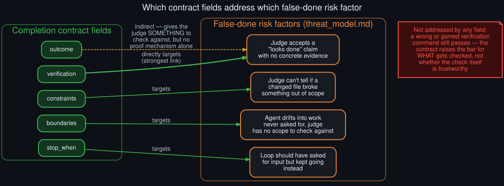

# Rollout: completion contract effectiveness review

  

Round 2, rollout 5 of 5 — see <a href="../ROLLOUTS.md">ROLLOUTS.md</a> for the full ledger. Closes round 2.

**Extends:** the "false `done` verdict on underspecified goal text" risk row in
[`../threat_model.md`](../threat_model.md), and the completion-contract mechanism described in
[`../technical_rationale.md`](../technical_rationale.md). A **review of the mechanism's design**,
not a live test — no experiment was run for this rollout, consistent with
[`../why_this_repo_exists.md`](../why_this_repo_exists.md)'s scope.

## The claim under review

`/goal`'s own documentation states that a completion contract changes the judge prompt so it
"decides `done` *only when the verification criterion is met with concrete evidence*" — not a
loose "looks done" claim. This rollout asks: which specific false-done risk factors does each of the
contract's five fields actually target, and which don't get addressed at all?

## Field-by-field review

- **`verification`** — the strongest link in the whole mechanism. This is the field that most
  directly targets the core risk: a judge asked to check for "a command result, file excerpt, test
  output" (per Hermes' own framing) has a concrete, checkable artifact to demand, rather than
  evaluating prose against prose. Of the five fields, this one does the most work.
- **`constraints`** — targets a different risk: not "is it done" but "did it break something it
  shouldn't have." Doesn't reduce false-done risk directly, but reduces a related failure mode
  (a technically-complete change that regresses something out of scope).
- **`boundaries`** — targets scope drift: without it, the judge has no defined boundary to check
  whether the agent wandered into unrelated work. This mostly guards against the loop declaring
  victory on the *wrong* thing, a different shape of false-positive than "declared victory too
  early on the right thing."
- **`stop_when`** — targets a distinct risk from false-done entirely: it's about the loop
  recognizing it should stop and ask for input, not about the judge's verdict accuracy on a given
  turn.
- **`outcome`** — the headline field, but on its own only an indirect lever on false-done risk: it
  gives the judge *something* to check the response against, but without `verification` alongside
  it, "the single end state that must be true" is still being assessed from prose, the same
  weakness a bare `/goal <text>` has.

## The gap no field addresses

None of the five fields protect against a **wrong or gamed verification command** — if
`verify: pytest tests/auth passes` is specified but the actual test suite doesn't cover the change
being judged, or if the agent's evidence text simply *asserts* the command passed without the
judge independently re-running it, the contract's structure doesn't catch that. This matters more
than it might look: [`../technical_rationale.md`](../technical_rationale.md) notes that quality
gates (a *stronger* mechanism — a deterministic shell command that must actually exit 0) exist
specifically because a contract alone is still "an LLM reading prose," just prose with better
scaffolding. This review's main finding is really a restatement of that existing design insight,
now traced field-by-field rather than asserted in general terms.

## What would need a real test, not just this review

Whether `verification` in practice measurably reduces false-done verdicts versus a bare goal is an
empirical question this review doesn't answer — it would need paired trials (same underlying task,
with and without a contract) judged by the same model, then checked against ground truth by a
human, structured the same way
[`deferral_rate_baseline_methodology`](deferral_rate_baseline_methodology.md) (round 2) argues any
before/after comparison in this space should be: a rate over a fair, equivalent-volume sample, not
an impression from a handful of anecdotes.

## Round 2 close-out

This is the last rollout of round 2. See [`../ROLLOUTS.md`](../ROLLOUTS.md) for round 3's
candidates, generated next — informed by this round's two corrected-source findings (the
background-review mechanism, the Kanban judging path) and the two confirmed/closed audits
(gateway interrupted-turn gap, this contract review).
