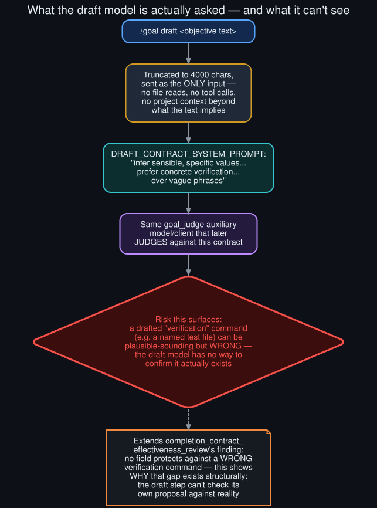

# Rollout: what the draft model is actually asked

  

Round 3, rollout 5 of 5 — see <a href="../ROLLOUTS.md">ROLLOUTS.md</a> for the full ledger. Closes round 3 and this repo's rollouts process.

**Extends:** [`completion_contract_effectiveness_review`](completion_contract_effectiveness_review.md)
(round 2), which reviewed the contract's five fields in the abstract without reading the actual
prompt that fills them in via `/goal draft`. This rollout reads `hermes_cli/goals.py`'s
`draft_contract()` and its system prompt directly.

## The actual prompt

`DRAFT_CONTRACT_SYSTEM_PROMPT`, quoted in full (it's short enough to):

> *"You turn a user's plain-language objective into a structured completion contract for an
> autonomous coding agent. The contract has five fields: outcome... verification... constraints...
> boundaries... stop_when... Infer sensible, specific values from the objective and any project
> context implied by it. Prefer concrete verification (a named test command, a build, a benchmark)
> over vague phrases. Keep each field to one or two sentences. If a field genuinely cannot be
> inferred, use an empty string for it. Reply ONLY with a single JSON object..."*

## What actually gets sent

`draft_contract(objective)` truncates the objective to 4000 characters and sends **that text
alone** as the user turn — no file reads, no tool calls, no access to the actual project beyond
whatever context the objective's own wording happens to imply. The instruction to "infer... from
the objective and any project context implied by it" is doing a lot of work: "implied by it" means
implied by the *text*, not observed from the *repository*.

## The structural risk this surfaces

[`completion_contract_effectiveness_review`](completion_contract_effectiveness_review.md) (round
2) identified that no contract field protects against a wrong or gamed verification command — "if
the actual test suite doesn't cover the change being judged... the contract's structure doesn't
catch that." Reading the drafting prompt shows *why* that gap exists structurally, not just that it
does: the draft model is explicitly instructed to prefer "a named test command" as concrete
verification, while having **no way to confirm that command actually exists** in the target
project. A plausible-sounding `verify: pytest tests/auth passes` can be drafted for a project with
no `tests/auth` directory at all, and nothing in the drafting step would catch it — the system
prompt asks for concreteness, not accuracy.

## One design detail worth keeping

`draft_contract()` calls through the same auxiliary client/model resolution as the per-turn judge
(`goal_judge`) — the model that drafts a contract's `verification` field is, by construction, the
same model that will later be asked to check evidence against it. This has a mild upside not
present if drafting used a different model: at minimum, the judge won't be confused by its own
draft's phrasing later, since it's evaluating against a standard it effectively set itself.

## What would close this gap

The fix isn't a bigger prompt — it's giving the draft step the one thing it's currently missing:
a way to check its own proposed `verification` field against the actual project before finalizing
it (e.g., a quick tool call to confirm a named test file or command exists). That's a real,
scoped feature idea this rollout surfaces but doesn't design in detail — a natural candidate for a
future round, were one to run.

## Closing the rollouts process

This is the fifteenth and final rollout across three rounds. See
[`../ROLLOUTS.md`](../ROLLOUTS.md) for the complete ledger — every candidate proposed, every pick's
reasoning, and links to all fifteen finished pieces, including the two real corrections this
process found in its own earlier work along the way.
