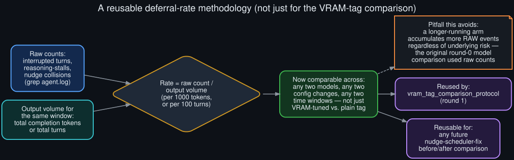

# Rollout: a reusable deferral-rate methodology

  

Round 2, rollout 3 of 5 — see <a href="../ROLLOUTS.md">ROLLOUTS.md</a> for the full ledger.

**Extends:** [`vram_tag_comparison_protocol`](vram_tag_comparison_protocol.md) (round 1), which
already noted in passing that a fair comparison needs a *rate*, not a raw count. This rollout pulls
that observation out into its own reusable methodology, since it applies to more than just the one
comparison it was originally scoped for.

## The pitfall this corrects

The core diagnosis in this repo's [README](../../README.md) compares raw interruption and
reasoning-stall **counts** across five models. That comparison is honest about what it is — a
count over *observed* usage, not a controlled experiment (see
[`../known_unknowns.md`](../known_unknowns.md)) — but it means the headline numbers conflate two
things: how *risky* a model's behavior is, and how *much* that model happened to run. A model used
ten times as much will rack up more raw interruptions than a riskier model used rarely, even if its
actual failure rate is lower.

## The methodology

**Numerator:** raw counts, exactly as the core diagnosis already gathers them — `grep`-able counts
of `interrupted_during_api_call`, `Reasoning-only clean stop`, and (once
[`deferral_telemetry_spec`](deferral_telemetry_spec.md) exists) `goal_deferral` lines, scoped to a
session or a time window.

**Denominator:** output volume over that same window — either total completion tokens generated
(from the `out=` field already present in the `API call #N` log lines) or total turns run, whichever
better matches the comparison being made.

**Rate:** raw count ÷ output volume, expressed per a fixed unit (per 1000 completion tokens, or per
100 turns) so two arms of very different lengths become directly comparable.

## Where this generalizes beyond the VRAM-tag comparison

This isn't specific to comparing model tags. The same rate calculation is the right tool for:

- **Validating [`goal_aware_nudge_scheduler_design`](goal_aware_nudge_scheduler_design.md)** (round
  1) once implemented — before/after nudge-collision rate on equivalent workloads is exactly how
  you'd confirm that design actually reduced collisions rather than just having fewer sessions
  observed.
- **Any future config change** — a nudge-interval tweak, a different judge model, a different
  turn-budget default — where "did this help" needs a number, not an impression.
- **Re-running the original per-model comparison itself**, if the raw counts in the README were
  ever revisited with enough log volume per model to compute rates instead — a natural follow-up
  this methodology makes concrete but doesn't itself execute (no rates are computed in this doc;
  the raw data to compute them accurately per-model wasn't available in this session's log window
  in even volume).

## What "even volume" requires in practice

A rate is only meaningful if the *denominator* is measured the same way for both arms — e.g., not
mixing "tokens from `out=` fields" for one arm with "turn count" for another. This sounds obvious
stated directly, but it's the exact kind of inconsistency that creeps in when a comparison is
assembled after the fact from logs that weren't captured with the comparison in mind, which is
precisely the situation the original per-model table in the README was in. Designing the
measurement *before* running the workload — as
[`vram_tag_comparison_protocol`](vram_tag_comparison_protocol.md) does — avoids this by construction.
