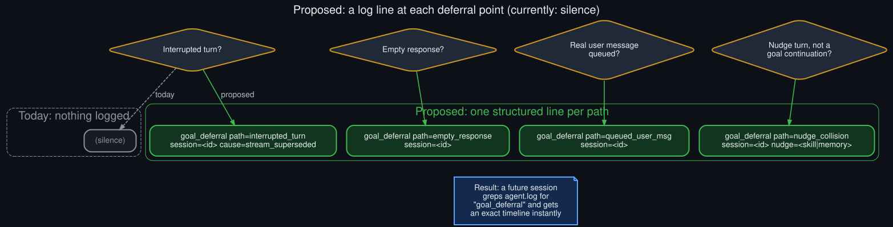

# Rollout: deferral telemetry spec

<p align="center">
  
</p>
<p align="center"><sub>Round 1, rollout 1 of 5 — see <a href="../ROLLOUTS.md">ROLLOUTS.md</a> for the full ledger.</sub></p>

**Extends:** the mid-term proposal in [`../future_directions.md`](../future_directions.md) —
"log a distinct line when the judge is skipped." This rollout works that proposal out to an
actual concrete format.

## The gap this closes

Reconstructing the nudge-collision timeline in the core diagnosis (see the
[README](../../README.md#root-cause-four-silent-deferral-paths)) took manually cross-referencing
several unrelated log lines across multiple turns — `turn_context`, `Turn ended`,
`auxiliary_client`, and the stale-stream message — none of which mention `/goal` or the judge at
all. The information needed was all there, just never assembled into one line that says "the
judge was skipped, and here's why."

## Proposed format

One structured line, emitted at the exact point in the post-turn hook where each deferral
decision is made — right where the function currently just `return`s with no side effect:

```
goal_deferral path=interrupted_turn session=<session_id> cause=stream_superseded
goal_deferral path=empty_response session=<session_id>
goal_deferral path=queued_user_msg session=<session_id>
goal_deferral path=nudge_collision session=<session_id> nudge=skill_library
goal_deferral path=nudge_collision session=<session_id> nudge=memory
```

Design choices, each deliberate:

- **`path=` is a closed enum matching the four deferral paths exactly**, not free text — so it's
  greppable and countable without any parsing beyond `grep 'goal_deferral path=X'`.
- **One line, `logger.info` level, same logger as the existing `hermes_cli.goals` judge-verdict
  lines** — so a session's full goal-loop history (judged turns and deferred turns alike) is
  visible with a single `grep -i goal_ agent.log`, not two separate greps that have to be manually
  interleaved by timestamp the way this session's diagnosis required.
- **`cause=` only on `interrupted_turn`**, since that's the one path with more than one possible
  trigger worth distinguishing (a genuine Ctrl+C vs. a nudge-driven supersession look identical
  today, and disambiguating them was one of this session's harder inference steps — see
  [`../known_unknowns.md`](../known_unknowns.md)).
- **`nudge=` only on `nudge_collision`**, naming which nudge type fired — skill-library and memory
  nudges have different intervals and different value profiles per [`../catch22.md`](../catch22.md),
  so knowing which one is colliding matters for tuning either interval independently.

## What this enables, directly

- [`goal_status_deferral_counter_mockup`](goal_status_deferral_counter_mockup.md) (round 1,
  rollout 5) consumes exactly this format to build its proposed `/goal status` counter — a count
  of `goal_deferral` lines since the goal was set, grouped by `path=`.
- [`cli_gateway_hook_parity_audit`](cli_gateway_hook_parity_audit.md) (round 1, rollout 2) can use
  the same format on both surfaces, making a future parity check a log-format comparison instead
  of a source-reading exercise.
- Any future diagnosis of this shape becomes a `grep` instead of a multi-hour log
  reconstruction — the entire point of this rollout.

## What this doesn't change

Purely additive — no behavior changes. Every deferral path keeps doing exactly what it does today
(auto-pause, silent skip, defer, wait-for-next-turn); this only adds a log line at the point the
decision is already being made. See [`../technical_rationale.md`](../technical_rationale.md) for
why the underlying behavior itself is intentional and shouldn't change.
