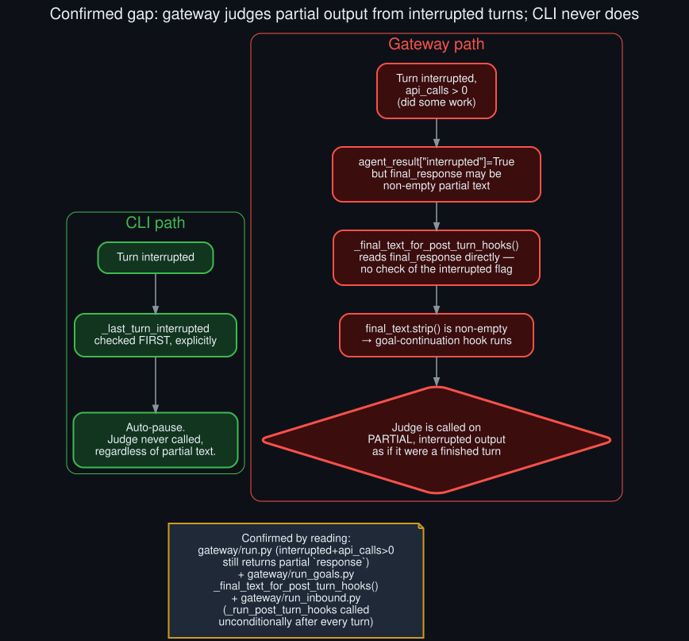

# Rollout: the gateway's interrupted-turn gap, confirmed

  

Round 2, rollout 2 of 5 — see <a href="../ROLLOUTS.md">ROLLOUTS.md</a> for the full ledger.

**Extends:** round 1 finding (b) from
[`cli_gateway_hook_parity_audit`](cli_gateway_hook_parity_audit.md) — "gateway: no equivalent
explicit interrupted-turn check found in this hook" — flagged there as *not confirmed either way*.
This rollout follows the gateway's turn-completion path further and confirms it: **the gap is
real.**

## What was read this time

Three additional points in the gateway source, beyond what round 1's audit covered:

1. **`gateway/run_inbound.py`**, the call site of `_run_post_turn_hooks` — it runs unconditionally
   right after a turn completes, with no gate on whether the turn was interrupted. The only case
   that skips it is a `TurnLeaseTimeoutError` (a *rejected* turn — the agent never ran at all),
   which is a different situation entirely from an interrupted-but-partially-completed turn.
2. **`gateway/run.py`**, the reply-building logic for an interrupted result: `if
   agent_result.get("interrupted"): ... if api_calls == 0: return <retry message>; return
   response` — confirming that an interrupted turn which did *some* work (`api_calls > 0`) still
   carries a real, non-empty `response` forward, not an empty string.
3. **`gateway/run_goals.py`**'s `_final_text_for_post_turn_hooks` (read in round 1, re-examined
   here specifically for this question): it reads `agent_result.get("final_response")` directly —
   no check of the `interrupted` flag anywhere in that function.

## The confirmed gap

Put together: an interrupted gateway turn that did some work before being cut off produces a
non-empty `final_response`. `_run_post_turn_hooks` only gates the goal-continuation hook on
`final_text.strip()` being non-empty — which it is. **The judge gets called on partial, interrupted
output, evaluated as if it were a complete turn's response**, something the CLI's explicit
`_last_turn_interrupted` check exists specifically to prevent (see
[`../technical_rationale.md`](../technical_rationale.md) for why that check exists on the CLI side
in the first place).

This isn't a hypothetical edge case — it's the direct, structural consequence of the gateway hook
never checking the one flag (`interrupted`) that the CLI hook checks first.

## Why this matters more than it might look

A judge evaluating a truncated response is working with less information than the design assumes.
Per [`../threat_model.md`](../threat_model.md)'s risk framing, this plausibly *raises* the
likelihood of the "false done verdict on underspecified evidence" row — a partial response might
read as more finished than it is, or the judge might reasonably return `continue` on a response
that was actually finished but got cut off in a way that looks incomplete. Either direction is a
worse input to the judge than the CLI path, which simply never puts a partial response in front of
it.

## What this doesn't establish

This confirms the gap in the *code path read* — it doesn't confirm how often gateway sessions
actually hit `interrupted=True, api_calls>0` in practice, nor whether the judge's own conservatism
(see [`../technical_rationale.md`](../technical_rationale.md)) happens to absorb most of the risk
in practice. That would need the same kind of log-based evidence this repo's core diagnosis used
for the CLI surface — gateway logs weren't available to check as part of this session. Recording
this as a fully separate open item rather than assuming it based on the source alone.

## Updated parity table

Round 1's table can now be updated with a firm answer on this row:

| Deferral path | CLI | Gateway |
|---|---|---|
| Interrupted turn → auto-pause | Confirmed | **Confirmed absent** — judge runs on partial output instead |
| Empty response → skip | Confirmed | Confirmed (different structure, same effect) |
| Queued real user message → defer | Confirmed (explicit check) | Still not read — remains open |
| Nudge collision | Race with the background-review subsystem, not a hook branch (see [`background_review_subsystem_deep_dive`](background_review_subsystem_deep_dive.md)) | Same subsystem — same race, by construction |

Three of four rows now settled; one (queued user message on the gateway) remains a genuinely open
item for a future rollout.
