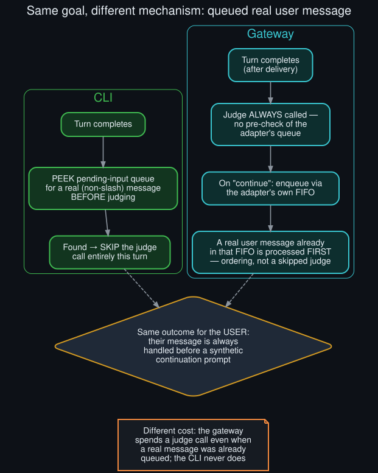

# Rollout: the gateway's queued-message handling, closed

  

Round 3, rollout 1 of 5 — see <a href="../ROLLOUTS.md">ROLLOUTS.md</a> for the full ledger.

**Extends:** the last open row in [`cli_gateway_hook_parity_audit`](cli_gateway_hook_parity_audit.md)'s
parity table (round 1) — "queued real user message → defer: not read in this pass." This rollout
reads `gateway/run_goals.py`'s `_post_turn_goal_continuation` specifically for this question and
closes the row.

## What the CLI does (recap from round 1)

Before calling the judge, the CLI hook peeks at `_pending_input` for a real (non-slash) message
already queued, and if found, returns immediately — no judge call at all this turn, deferred
until after the user's message runs.

## What the gateway actually does

`_post_turn_goal_continuation` has no equivalent pre-check. It goes straight from `is_active()` to
gathering background-process context and calling `mgr.evaluate_after_turn(...)` — the judge always
runs, regardless of whether a real user message is already sitting in the adapter's delivery
queue. The user-priority guarantee is handled entirely **after** judging, at the point a
`continue` verdict would enqueue a synthetic prompt: the gateway's own comment states the intent
directly — *"Enqueue via the adapter's FIFO so a user message already in flight preempts
naturally."* The synthetic continuation prompt goes into the same FIFO as any queued real message,
and FIFO ordering — not a skipped judge call — is what guarantees the user's message gets
processed first.

## The row, closed

| Deferral path | CLI | Gateway |
|---|---|---|
| Queued real user message → defer | Pre-emptively skips the judge call | **Judge always runs; user-priority is enforced at delivery via FIFO ordering, not by skipping the judge** |

Both surfaces achieve the same end-user guarantee — a real message is never overtaken by a
synthetic continuation — but by genuinely different mechanisms, not by one surface simply omitting
a check the other has. This is the fourth and final row from round 1's parity table, and it's the
first of the four where neither surface is "missing" something relative to the other — they're
just built differently, both intentionally.

## Why this difference makes sense, once named

The CLI's pending-input queue is a local, synchronous, single-process structure it can peek at
directly. The gateway's adapter FIFO is a cross-platform delivery abstraction — Discord, Telegram,
CLI-over-gateway, and others each have their own queue semantics under a shared interface. Peeking
"is there a real message queued" *before* judging would mean the goal hook reaching into
platform-specific delivery internals; enforcing order *at enqueue time* through the same FIFO every
message already flows through is the more natural fit for that architecture. This isn't a case of
one surface having a bug the other doesn't — it's two different designs solving the same
constraint appropriately for their own context.

## Full parity table, final state (rounds 1–3)

| Deferral path | CLI | Gateway |
|---|---|---|
| Interrupted turn → auto-pause | Confirmed | Confirmed absent — judge runs on partial output ([`gateway_interrupted_turn_gap`](gateway_interrupted_turn_gap.md)) |
| Empty response → skip | Confirmed | Confirmed (different structure, same effect) |
| Queued real user message → defer | Pre-emptive skip | Judge always runs; order enforced at delivery (this rollout) |
| Nudge collision | Race with the background-review subsystem | Same subsystem, same race ([`background_review_subsystem_deep_dive`](background_review_subsystem_deep_dive.md)) |

Three of four rows now fully characterized with source evidence; the interrupted-turn row remains
the one place the two surfaces genuinely diverge in user-visible behavior, not just mechanism.
