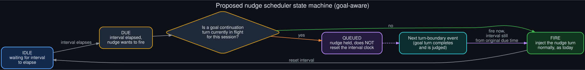

# Rollout: goal-aware nudge scheduler design

  

Round 1, rollout 4 of 5 — see <a href="../ROLLOUTS.md">ROLLOUTS.md</a> for the full ledger.

**Extends:** the resolution [`../catch22.md`](../catch22.md) points toward — nudges shouldn't fire
*less*, they should fire *around* an active goal loop instead of *into* it. This rollout works
that idea into an actual state machine.

> **Refinement (round 3):** the "interval" here is described generically; the actual mechanism —
> two separate counters with different units (tool iterations vs. turns), plus an
> interruption gate — is read from source in
> [`nudge_interval_source_reading.md`](nudge_interval_source_reading.md). The state machine below
> still holds; that doc has the concrete detail an implementation would need.

## The design goal

From [`../catch22.md`](../catch22.md): widening the nudge interval trades goal-loop reliability
against long-run session health, because both pulls scale with the same variable (how long the
loop runs). A scheduler that's aware of whether a goal continuation is currently in flight sidesteps
the tradeoff entirely — nudges keep their original interval and their original value, they just
stop landing on top of a judge call.

## States

- **IDLE** — waiting for the configured interval (skill-library or memory, independently) to
  elapse. Identical to today's behavior.
- **DUE** — the interval has elapsed and the nudge wants to fire. This is the moment today's
  scheduler just fires unconditionally; the proposed design inserts one check here.
- **The check:** *is a goal continuation turn currently in flight for this session?* This is a
  single boolean read — the same `mgr.is_active()` check the goal hooks themselves already use,
  plus a flag for "currently mid-turn" that the turn loop already tracks for other purposes (the
  interruption/supersession logic depends on knowing this already).
- **FIRE** — no goal turn in flight: inject the nudge exactly as today, reset the interval clock.
  No behavior change from the current system in this branch.
- **QUEUED** — a goal turn is in flight: hold the nudge. Critically, **do not reset the interval
  clock** — the nudge is now overdue, not rescheduled, so it fires at the next opportunity rather
  than waiting a full new interval.
- **Turn-boundary event** — when the in-flight goal turn completes and gets judged (or deferred
  for one of the other three reasons), that's the next safe point to fire a QUEUED nudge. The
  nudge fires there, still crediting the interval from its original due time.

## Why "queued, not skipped"

A scheduler that simply skips a nudge that lands mid-goal-turn would slowly starve skill/memory
maintenance on exactly the sessions that generate the most material worth capturing — the long
`/goal` loops. Queuing preserves the *count* of nudges over a session's lifetime; it only changes
*when* each one lands, by at most one turn.

## Why "don't reset the clock"

If the interval reset on every deferral, a goal loop with frequent judge calls could push a nudge
back indefinitely — every time it becomes due, the goal loop is still active, so it never fires.
Crediting the original due time means a queued nudge fires at the very next turn boundary,
guaranteed, rather than competing with the interval on every check.

## Interaction with the telemetry spec

If [`deferral_telemetry_spec`](deferral_telemetry_spec.md) (rollout 1) were implemented
alongside this, the QUEUED → FIRE transition is exactly the moment a `nudge_collision` deferral
line would have been logged today — this design replaces "log that it happened" with "prevent it
from happening at all," which is the stronger fix the telemetry spec's own doc frames as a
mid-term step toward.

## What this doesn't address

This design is scoped to the nudge-vs-goal collision specifically. It doesn't touch the other
three deferral paths (interrupted turns, empty responses, queued user messages) — see
[`../technical_rationale.md`](../technical_rationale.md) for why those three are intentional
fail-open behavior that shouldn't change, unlike the nudge collision, which this repo's diagnosis
treats as an unintended side effect of two independent schedulers sharing conversation state.
