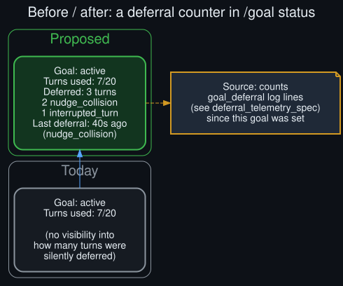

# Rollout: `/goal status` deferral counter mockup

<p align="center">
  
</p>
<p align="center"><sub>Round 1, rollout 5 of 5 — see <a href="../ROLLOUTS.md">ROLLOUTS.md</a> for the full ledger.</sub></p>

**Extends:** the longer-term proposal in [`../future_directions.md`](../future_directions.md) —
"a `/goal`-visible deferral counter, surfaced in `/goal status` output." This rollout closes
round 1 by mocking up exactly what that would look like, built directly on rollout 1's telemetry
format.

## Today's output

```
Goal: active
Turns used: 7/20
```

Accurate, but silent about anything that happened *between* judged turns. A user watching a long
goal loop has no way to distinguish "7 turns judged, loop running smoothly" from "7 turns judged,
also 3 turns silently deferred along the way" without reading raw logs — exactly the gap
[`../howto.md`](../howto.md) exists to work around manually today.

## Proposed output

```
Goal: active
Turns used: 7/20
Deferred: 3 turns
  2 nudge_collision
  1 interrupted_turn
Last deferral: 40s ago (nudge_collision)
```

## Where the numbers come from

Directly from [`deferral_telemetry_spec`](deferral_telemetry_spec.md) (rollout 1): each
`goal_deferral path=<X>` log line, counted and grouped by `path=` since the goal was set. No new
counting mechanism is needed beyond what that rollout already specifies — this is a presentation
layer on top of it, which is why it was picked last in this round (see the selection reasoning in
[`../ROLLOUTS.md`](../ROLLOUTS.md)): it depends on that vocabulary existing to be worth specifying
precisely.

## Design choices

- **Grouped by path, not just a total.** A raw "3 deferred" tells a user less than knowing 2 were
  nudge collisions (self-resolving, no action needed) and 1 was an interrupted turn (which
  auto-paused the goal — worth a `/goal resume` check, per [`../howto.md`](../howto.md)).
- **"Last deferral" with its type and recency**, not just a count — the single most useful line
  for "is my goal stuck right now" is knowing what happened most recently, not a lifetime total.
- **Only shown when non-zero.** A goal with zero deferrals shows exactly today's output, unchanged
  — this is additive, not a rewrite of the existing status format.

## Interaction with the other round 1 rollouts

This mockup is the natural capstone of round 1: it's a *consumer* of
[`deferral_telemetry_spec`](deferral_telemetry_spec.md)'s format, its "nudge_collision" row is
exactly what [`goal_aware_nudge_scheduler_design`](goal_aware_nudge_scheduler_design.md) proposes
eliminating (a successful scheduler change would show up here as that row trending toward zero
over time — a built-in success metric for that design, for free), and
[`cli_gateway_hook_parity_audit`](cli_gateway_hook_parity_audit.md)'s finding that the CLI and
gateway hooks aren't fully confirmed at parity means this counter would need verifying on both
surfaces before being trusted as accurate everywhere `/goal status` runs.

## What round 1 leaves open

None of these five rollouts change any actual behavior — they're specs, an audit, and a protocol.
[`../future_directions.md`](../future_directions.md)'s roadmap places implementing any of them
as a "near-to-mid-term" step; this repo documents the plan, not the shipped feature. See
[`../ROLLOUTS.md`](../ROLLOUTS.md) for round 2's candidates, generated next.
