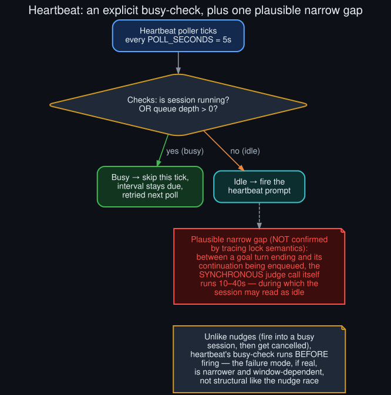

# Rollout: does heartbeat collide with `/goal` too?

<p align="center">
  
</p>
<p align="center"><sub>Round 3, rollout 3 of 5 — see <a href="../ROLLOUTS.md">ROLLOUTS.md</a> for the full ledger.</sub></p>

**Extends:** [`../meta_loop_integrations.md`](../meta_loop_integrations.md)'s note that heartbeat
"shares the same category of... periodic mechanism that can inject a turn into a session that
might also be running a goal loop," flagged there as "worth keeping in mind" but not checked. This
rollout checks it against source.

## Heartbeat's actual busy-check

Unlike the background-review nudges (which fire unconditionally and get cancelled reactively —
see [`background_review_subsystem_deep_dive`](background_review_subsystem_deep_dive.md)),
heartbeat's poller in `gateway/run_goals.py`'s `_heartbeat_poll_watch` checks **before** firing:

```python
if (
    self._is_session_running(quick_key)
    or quick_key in adapter._active_sessions
    or self._queue_depth(quick_key, adapter=adapter) > 0
):
    return  # keep missed intervals due until user work has drained
```

If the session is running a live turn, marked active, or has anything already queued, the poller
simply skips this tick and re-checks on the next one — `POLL_SECONDS = 5.0` in `hermes_cli/heartbeat.py`.
This is structurally different from the nudge collision this repo's core diagnosis documents: it's
a proactive skip, not a fire-then-cancel race.

## A plausible narrow gap — not confirmed

One window this check doesn't obviously cover: `/goal`'s judge call is explicitly documented (in
a comment read during this session's original investigation, in `gateway/run_goals.py`) as a
**synchronous auxiliary-LLM HTTP call taking 10–40 seconds**, run *after* the live turn has already
ended and *before* the continuation prompt is enqueued into the FIFO. In that window, the live
turn is over (so `_is_session_running` may read false) and nothing is queued yet (so
`_queue_depth` may read zero) — the two conditions the heartbeat check relies on to detect
"busy." A heartbeat poll landing in that specific window, given a 5-second poll cadence against a
10–40 second judge call, is plausible on ordinary timing grounds.

**This was not confirmed** by tracing the exact semantics of `_is_session_running` and
`_active_sessions` during a judge call specifically — it's possible either of those flags is set
for the whole judge-evaluation window by some mechanism not read as part of this rollout. Recorded
here as a plausible, timing-motivated hypothesis, not a demonstrated bug, consistent with this
repo's standard for what counts as confirmed (see
[`../why_this_repo_exists.md`](../why_this_repo_exists.md)).

## Why this failure mode, if real, is narrower than the nudge race

Even in the worst case, a heartbeat prompt landing during a judge call would inject one extra turn
into the session — closer in shape to the "queued real user message" deferral path than to the
nudge race, since it's a single potential collision on a specific narrow window, not a
structural, every-time race between two subsystems that share conversation state. It also wouldn't
interact with the interrupted-turn deferral path at all, since the live turn in question has
already ended cleanly by the time this window opens.

## What would confirm or rule this out

Reading `_is_session_running`'s implementation directly, and/or reproducing the scenario with a
heartbeat interval set deliberately short against a goal loop with a slow judge model, would
settle this. Neither was done here — see
[`../known_unknowns.md`](../known_unknowns.md) for how this joins the standing list of open items
this repo has accumulated across all three rounds.
