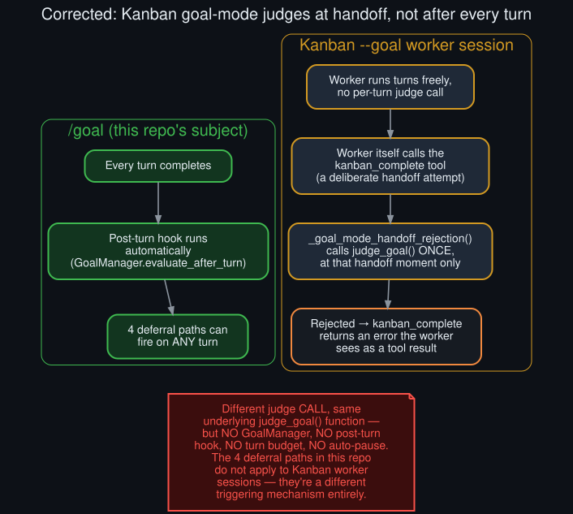

# Rollout: Kanban goal-mode worker session audit

  

Round 2, rollout 4 of 5 — see <a href="../ROLLOUTS.md">ROLLOUTS.md</a> for the full ledger.

**Extends:** the open item in [`../meta_loop_integrations.md`](../meta_loop_integrations.md) —
"a Kanban `--goal` card's worker session... plausibly applies identically to a goal-mode card's
worker session — worth confirming directly rather than assuming." This rollout reads the actual
Kanban source and finds the assumption was wrong in an important way.

## What the docs imply vs. what the source shows

Hermes' own `/goal` documentation (quoted in
[`../meta_loop_integrations.md`](../meta_loop_integrations.md)) describes a `--goal` Kanban card
as running "the same Ralph-style continuation engine as `/goal` — but scoped inside that one
card's own worker session." Read at face value, that suggested the whole apparatus this repo
documents — `GoalManager`, the post-turn hook, the four deferral paths — would apply identically
inside a worker session, just with a different session wrapper around it.

**That's not what the code does.** `hermes_cli/kanban.py` and `tools/kanban_tools.py` both import
`judge_goal` directly from `hermes_cli.goals` — a bare judge-calling function — and neither imports
`GoalManager` at all.

## How Kanban goal-mode actually judges

The function `_goal_mode_handoff_rejection()` in `kanban.py` is the judge entry point, and its own
docstring is explicit: *"Goal judge for every terminal worker handoff (including review)."* It only
runs when the worker itself attempts to complete or hand off its card — triggered by the worker
calling the `kanban_complete` tool, not by a post-turn hook that fires automatically after every
turn the way `GoalManager.evaluate_after_turn()` does for `/goal`.

Concretely: a Kanban `--goal` worker can run any number of turns with **no judge call at all** in
between — no `GoalManager.is_active()` check, no turn-budget tracking, no interrupted-turn
auto-pause, no nudge-collision race (there's no post-turn hook for a nudge to collide with in the
first place). The judge is consulted exactly once per handoff attempt, evaluating whatever evidence
the worker itself presents in its `kanban_complete` call. A rejected handoff returns as a tool
error the worker sees directly — this matches log evidence seen in this repo's original
investigation (`Tool kanban_complete returned error: {"error": "Goal completion rejected by
judge: ..."}`), which is the exact mechanism this rollout traces to source.

## Why "same engine" is still true at one level

The *judging function itself* — `judge_goal()` — is genuinely shared between `/goal` and Kanban
goal-mode; both eventually call the same underlying judge logic with a goal description and
evidence text. What differs entirely is **when** that function gets called and **what** decides to
call it. `/goal` wraps it in `GoalManager` with automatic per-turn triggering and all the
deferral machinery this repo documents; Kanban goal-mode wraps it in a handoff-time check the
worker triggers itself.

## What this means for the rest of this repo

**The four deferral paths documented in the [README](../../README.md) do not apply to Kanban
`--goal` worker sessions.** There's no post-turn hook for a turn to be silently deferred from —
a worker session's judging is worker-initiated, not automatic, so "the judge didn't fire this turn"
isn't even a meaningful sentence in that context. Any future work extending this repo's diagnosis
to Kanban should treat it as a genuinely separate mechanism, not an instance of the same one, despite
the shared "same engine" phrasing in the upstream docs — that phrasing describes the *loop
philosophy* (keep working until judged done), not the *judging trigger mechanism*, which this
audit shows are two different things.

## Closing `../meta_loop_integrations.md`'s open item

That doc's Kanban section can be read as confirmed-corrected by this rollout: the engine is shared
at the judge-function level only; the automatic, per-turn triggering and all four deferral paths
are specific to `/goal`'s `GoalManager` and don't extend to Kanban goal-mode as originally assumed.
