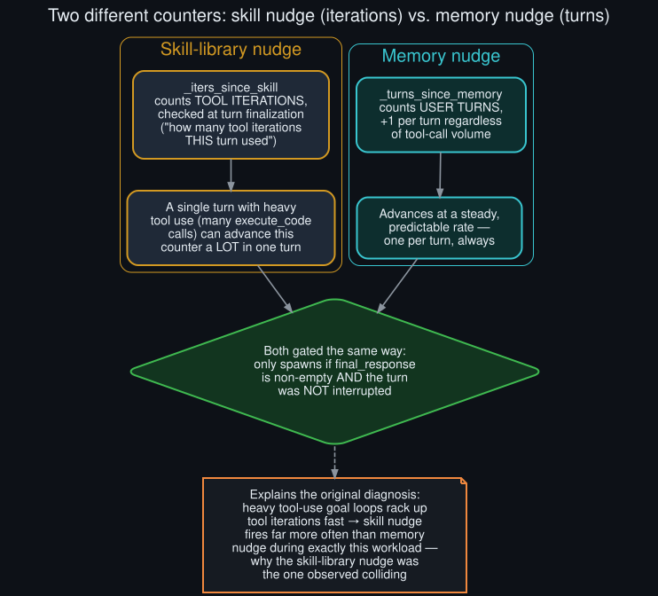

# Rollout: what actually decides a nudge is "due"

<p align="center">
  
</p>
<p align="center"><sub>Round 3, rollout 2 of 5 — see <a href="../ROLLOUTS.md">ROLLOUTS.md</a> for the full ledger.</sub></p>

**Extends:** [`background_review_subsystem_deep_dive`](background_review_subsystem_deep_dive.md)
(round 2), which explicitly flagged the interval-scheduling logic as unread and load-bearing for
[`goal_aware_nudge_scheduler_design`](goal_aware_nudge_scheduler_design.md) (round 1) to actually
be implementable. This rollout reads it — `agent/turn_finalizer.py` and `agent/turn_context.py` —
and finds the two nudge types don't even count the same thing.

## The skill-library nudge: counts tool iterations

`agent/turn_finalizer.py` checks the trigger at turn finalization, with a comment that states the
unit directly: *"Skill trigger is checked NOW — based on how many tool iterations THIS turn
used."*

```python
_should_review_skills = (
    agent._skill_nudge_interval > 0
    and agent._iters_since_skill >= agent._skill_nudge_interval
    and "skill_manage" in agent.valid_tool_names
)
```

`_iters_since_skill` accumulates **tool iterations**, not turns or wall-clock time. A single turn
with heavy tool use — the long `execute_code` chains seen throughout this repo's original log
evidence, e.g. a turn logged with `tool_turns=58` — can advance this counter substantially in one
turn alone.

## The memory nudge: counts user turns

`agent/turn_context.py`'s `_tick_memory_nudge` is explicit about its own unit:

```python
def _tick_memory_nudge(agent: Any) -> bool:
    """Advance the turn-based memory nudge counter..."""
    if (agent._memory_nudge_interval > 0 and "memory" in agent.valid_tool_names and agent._memory_store):
        agent._turns_since_memory += 1
        if agent._turns_since_memory >= agent._memory_nudge_interval:
            agent._turns_since_memory = 0
            return True
    return False
```

`_turns_since_memory` increments exactly once per turn, regardless of how many tool calls that
turn contained — a steady, predictable rate, unlike the skill counter.

## Why this matters: it explains an asymmetry in the original diagnosis

This repo's [README](../../README.md) log evidence for the nudge-collision deferral path shows a
**skill-library** nudge colliding with a goal continuation, not a memory nudge. This rollout's
finding explains why that's not a coincidence: the sessions observed were heavy-tool-use goal
loops (many `execute_code` calls per turn, driving many API calls per turn). That workload shape
advances the iteration-counted skill trigger far faster than the turn-counted memory trigger,
making a skill-nudge collision proportionally more likely to be the one caught in any given log
window — independent of whether the two intervals are configured to similar effective frequencies
in wall-clock terms.

## Both gated the same way on interruption

Both triggers share one more property, found in the same `turn_finalizer.py` block: the actual
background review is only spawned `if (final_response and not interrupted and ... )`. **An
interrupted turn never triggers a nudge at all**, regardless of either counter's value — this
narrows the nudge-collision scenario specifically to clean, non-interrupted turns with a real
response, which is worth folding back into how
[`goal_aware_nudge_scheduler_design`](goal_aware_nudge_scheduler_design.md) describes its own
`DUE` state: a nudge can only become due to check against an in-flight goal turn on a turn that
itself completed cleanly — never as a side effect of an already-interrupted one.

## What this changes in round 1's design spec

[`goal_aware_nudge_scheduler_design`](goal_aware_nudge_scheduler_design.md)'s `IDLE`/`DUE` states
described "waiting for the configured interval to elapse" without specifying units, implicitly
reading as time-based. It's actually count-based, and the two nudge types count different things
entirely — a goal-aware scheduler implementation would need to hook the check into two separate
existing counters (`_iters_since_skill` and `_turns_since_memory`), not one unified interval clock.
The state machine's shape (DUE → check → FIRE or QUEUE) still holds; only the mechanism advancing
a state into DUE differs per nudge type, and this rollout is what makes that concrete enough to
actually implement against.
