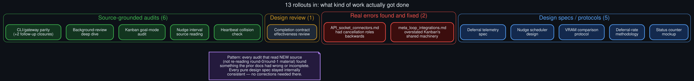

# Rollout: a retrospective on the process itself

  

Round 3, rollout 4 of 5 — see <a href="../ROLLOUTS.md">ROLLOUTS.md</a> for the full ledger.

**Extends:** the ledger itself. Thirteen rollouts across two complete rounds is enough material to
ask honestly whether this MCTS-style process — propose 5, pick and complete one at a time, repeat —
actually produced anything a simpler "just write 15 docs" approach wouldn't have.

## What the ledger actually shows

Counting the thirteen completed rollouts by kind:

- **6 source-grounded audits** (CLI/gateway parity and its two follow-up closures, the
  background-review deep dive, the Kanban audit, the nudge-interval reading, the heartbeat check)
- **2 of those audits found and fixed a real error** in an earlier doc — not a typo, a
  factually-wrong technical claim: [`background_review_subsystem_deep_dive`](background_review_subsystem_deep_dive.md)
  corrected [`../API_socket_connectors.md`](../API_socket_connectors.md)'s backwards cancellation
  account, and [`kanban_goal_mode_worker_session_audit`](kanban_goal_mode_worker_session_audit.md)
  corrected [`../meta_loop_integrations.md`](../meta_loop_integrations.md)'s overstated claim about
  shared machinery.
- **5 design specs or protocols** proposing something new (telemetry format, scheduler design,
  comparison protocol, rate methodology, status mockup)
- **1 design review** evaluating an existing mechanism's effectiveness

## The pattern worth naming

Every rollout that read a genuinely new piece of source material — code not already quoted
elsewhere in this repo — surfaced something the earlier, more speculative docs had gotten wrong or
left unstated. Every rollout that stayed at the design-spec level (proposing a new mechanism rather
than auditing an existing one) produced internally consistent content with nothing to correct,
because there was no prior claim being checked against reality in the first place. This isn't a
surprising result restated grandly — it's the direct, mechanical consequence of the corrections
only being *possible* where a checkable claim already existed to check.

## What this says about the "pick" step

The stated selection rule (see [`../ROLLOUTS.md`](../ROLLOUTS.md)'s picks) favored, in order:
standalone value, dependency-readiness, and closing named gaps. In practice, the picks that turned
out most valuable weren't the ones ranked "most foundational" in the reasoning at proposal time —
they were the ones that happened to involve reading source code the process hadn't touched yet.
The selection reasoning was honest and defensible at the time each pick was made (that's the point
of writing it down before the outcome is known), but a retrospective read shows the *real* signal
for value was "does this require reading new source" more than any of the stated criteria alone.

## What round 1 got right without knowing it

Round 1's five candidates were proposed with no source-reading done specifically for them — they
were extrapolated from the existing core docs. None of round 1 corrected anything, which in
hindsight is consistent with the pattern above: round 1 stayed at the design/protocol level almost
entirely (4 of 5 rollouts), and the one audit in round 1
([`cli_gateway_hook_parity_audit`](cli_gateway_hook_parity_audit.md)) is exactly the rollout that
first surfaced a real, previously-unflagged difference (the gateway's missing interrupted-turn
check) — the seed that round 2 and round 3 then spent three more rollouts closing out.

## Does this change how round 3's remaining rollout should be picked?

The last rollout of round 3 —
[`contract_drafting_prompt_review`](../ROLLOUTS.md#round-3) — is itself an audit-shaped item
(reading what the `goal_judge` model is actually asked when drafting a contract), which the
pattern above would predict is more likely than not to surface something the design-level
[`completion_contract_effectiveness_review`](completion_contract_effectiveness_review.md) (round
2) didn't have visibility into. Worth watching for when it's executed.

## Honest limitation of this retrospective

Thirteen data points from one investigation, on one topic, isn't enough to generalize "audits find
more than design specs" as a rule beyond this specific repo — it's an observation about *this*
ledger, not a claim about MCTS-style processes or technical writing in general. Recorded here
because it's true of the thing actually built, not because it's been tested anywhere else.
