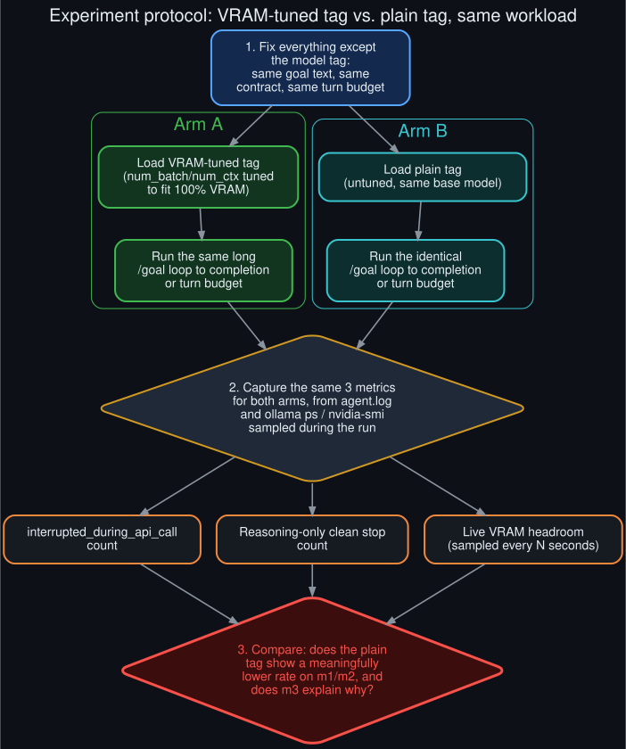

# Rollout: VRAM-tag comparison protocol

  

Round 1, rollout 3 of 5 — see <a href="../ROLLOUTS.md">ROLLOUTS.md</a> for the full ledger.

**Extends:** the leading unresolved hypothesis in [`../known_unknowns.md`](../known_unknowns.md) —
whether a model tag tuned to fit 100% in VRAM leaves less headroom under sustained long-context
goal loops than the same base model's plain tag. This rollout doesn't run the experiment; it
specifies exactly how to run it so the result is trustworthy the first time.

## Why a protocol, not just "try it"

The original diagnosis compared interruption counts *across different models*, which conflates
two variables: the model itself, and how heavily/how-long each one happened to be used in the
sessions observed. A fair test needs to hold everything constant except the one variable in
question — the tag's VRAM tuning — which means designing the comparison before running it, not
after.

## Protocol

**Step 1 — fix everything except the model tag.** Same goal text, same completion contract (if
any), same turn budget, ideally the same underlying task shape (a task with real tool-call
variety, not a trivial one, since the original interruptions were observed during substantive
work).

**Step 2 — two arms, run back to back on an otherwise-idle machine:**

- **Arm A:** load the VRAM-tuned tag, run the goal loop to completion or turn budget.
- **Arm B:** load the plain (untuned) tag of the same base model, run the identical goal loop to
  completion or turn budget.

Running back to back on an idle machine (rather than concurrently, or alongside other loaded
models) controls for the "concurrent background-review contention" variable documented in
[`../API_socket_connectors.md`](../API_socket_connectors.md) — the point here is to isolate the
VRAM-headroom hypothesis specifically, not to reproduce every confound in the original diagnosis
at once.

**Step 3 — capture three metrics identically for both arms:**

1. **`interrupted_during_api_call` count** — grep `agent.log` for this exact string, scoped to the
   session id of each arm's run.
2. **Reasoning-only clean stop count** — grep for `Reasoning-only clean stop`, same scoping.
3. **Live VRAM headroom, sampled periodically** — `nvidia-smi --query-gpu=memory.used,memory.total
   --format=csv -l 10` (or equivalent) running alongside each arm, or `ollama ps` polled on the
   same interval, logged to a file for later correlation against the timestamps of any
   interruption events from metric 1.

**Step 4 — compare.** Does the plain tag show a meaningfully lower rate on metrics 1 and 2 for an
equivalent amount of generated output? Does metric 3 show the VRAM-tuned tag running measurably
closer to its ceiling at the point each interruption occurs? A "yes" on both would confirm the
hypothesis; a "yes" on interruption rate but "no correlation" on VRAM headroom would point back to
[`../API_socket_connectors.md`](../API_socket_connectors.md)'s alternative explanation (stream
contention) instead.

## What would make this result trustworthy

- Both arms should generate a **comparable volume of output** (turns, tokens) before comparing raw
  counts — a rate (interruptions per 1000 output tokens, say), not a raw count, is the actual
  comparable metric, since a longer-running arm will accumulate more raw events regardless of
  underlying risk.
- Ideally run more than once per arm — a single run of either arm doesn't distinguish a
  systematic difference from ordinary run-to-run variance.

## What this rollout deliberately doesn't do

This is a protocol, not a result — no experiment was run as part of writing this doc. See
[`../why_this_repo_exists.md`](../why_this_repo_exists.md) for why: this repo documents observed
behavior and proposes concrete next steps, rather than asserting a conclusion the evidence
gathered so far doesn't yet support.
