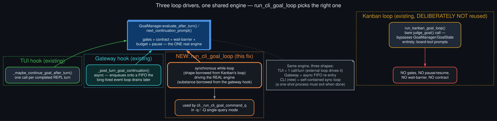

# run_cli_goal_loop architecture

  

Fixing the single-query gap needed a fourth "loop driver" alongside the three that already exist
in Hermes, and choosing its shape meant picking apart what each existing one actually does.

The TUI hook, `_maybe_continue_goal_after_turn`, isn't itself a loop — it's a single function
called once per completed REPL turn by an *external* loop that already exists (the interactive
REPL's own polling of `self._pending_input`). It's tightly coupled to that REPL state and can't be
reused standalone.

The gateway's `_post_turn_goal_continuation`/`_run_post_turn_hooks` has the right substance —
it drives via `GoalManager.evaluate_after_turn`/`next_continuation_prompt`, the same engine with
full gates/contract/wait-barrier/budget/pause semantics the TUI hook uses — but the wrong shape
for a one-shot process: it's async, and "continuing the loop" just means enqueueing onto a FIFO
that a long-lived event loop drains on its own later. A `-q` invocation is a single synchronous
process that has to exit when the goal is done; there's no later drain to hand off to.

`run_kanban_goal_loop` has the right shape — a synchronous `while True` a one-shot caller can run
to completion — but the wrong substance: it bypasses `GoalManager`/`GoalState` completely, calling
`judge_goal` directly with no persistence, no pause/resume, no gates, no wait-barrier, and
continuation prompts that explicitly instruct the model to call Kanban board tools. None of that
applies outside an actual Kanban worker.

`run_cli_goal_loop` takes the gateway hook's substance and the Kanban loop's shape: a synchronous
loop, driven by the real `GoalManager` engine, that a `-q`/`-Q` process can run start-to-finish and
then exit. `cli._run_cli_goal_command_q` wires it in — parses the query via the same shared
`dispatch_goal_command` the interactive path uses, then drives the loop with a `run_turn` closure
that calls `cli.agent.run_conversation` (quiet mode) or `cli.chat` (chat mode, to keep the live
tool-activity feed the Kanban chat-mode loop already relies on). It explicitly no-ops when
`HERMES_KANBAN_GOAL_MODE=1` is set, so the two systems never conflate.
