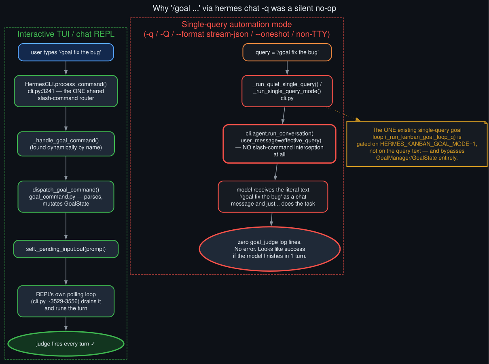

# Single-query mode gap

  

This is a different bug from everything else in this repo — not a deferral, a total no-op. Typing
`/goal fix the bug` into `hermes chat -q "..."` (or `--format stream-json`, `-Q`, `--oneshot`, or
any non-TTY invocation) never reaches a command parser at all. It goes straight to
`cli.agent.run_conversation`/`cli.chat` as a literal chat message, and the model just does
whatever it can with the leading `/goal ` text as noise.

The interactive path works because `HermesCLI.process_command()` (`cli.py`) is the one shared
slash-command router every interactive surface calls before a turn runs — it resolves the command
name, dispatches (statically or, for `/goal`, by dynamically finding `_handle_goal_command`), and
that handler calls `dispatch_goal_command()`, then queues the resulting prompt onto
`self._pending_input`, a plain `queue.Queue` the REPL's own polling loop drains on every
iteration. Single-query mode's two entry points — `_run_quiet_single_query` and
`_run_single_query_mode`'s chat branch — never call `process_command`, and there's no REPL loop
to drain a pending-input queue even if something did queue onto it.

The one goal-loop mechanism that *does* exist in single-query mode,
`_run_kanban_goal_loop_q`/`_run_kanban_goal_loop_chat`, is gated on the `HERMES_KANBAN_GOAL_MODE`
environment variable — set by the Kanban dispatcher for `--goal` cards — not on whether the query
text starts with `/goal`. It also bypasses `GoalManager`/`GoalState` entirely, calling `judge_goal`
directly with Kanban-board-specific continuation prompts. A bare `/goal` typed into `-q` has no
path to either mechanism.

Confirmed live before fixing anything: a real `hermes chat -q "/goal <task>" --format stream-json`
run produced zero `hermes_cli.goals`/`Auxiliary goal_judge` lines in `agent.log`, while the
already-running interactive session on the same box had fired the judge 25+ times that same
afternoon. See [`live_verification_evidence`](live_verification_evidence.md) for the exact
before/after log lines from the same repro re-run against the patched code.
