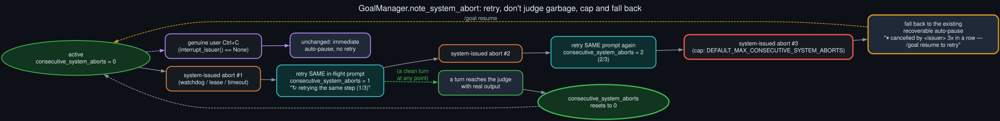

# System-abort retry state machine

  

Knowing a turn was aborted for a system reason isn't enough on its own — the old behavior (pause
unconditionally) was at least *safe*, just wrong about whose intent it was honoring. The
replacement, `GoalManager.note_system_abort(issuer, retry_prompt)`, has to be at least as safe
while actually recovering from the common case.

On a system-issued abort it increments a new `GoalState.consecutive_system_aborts` counter and
re-enqueues the exact same prompt that was in flight — not a fresh judge call on whatever partial,
possibly-garbled text the aborted turn produced. That choice is deliberate: `evaluate_after_turn`
burns a real `turns_used` slot unconditionally, before the judge even runs, and a judge fed a
visibly truncated response will very likely just say "continue" anyway — the same reasoning the
original Ctrl+C handling already used for interrupted turns. Retrying is strictly better than
judging noise, as long as it can't run forever.

That's what the cap is for: `DEFAULT_MAX_CONSECUTIVE_SYSTEM_ABORTS = 3`. Three system-issued
aborts in a row on the same goal falls back to the exact same recoverable pause the old code
always did, now with a message naming the actual issuer and the count, so a persistently-thrashing
watchdog (say, sustained GPU contention that fix #2 didn't fully resolve) still has the same
safety valve as before — it just takes three strikes instead of one to reach it. Any turn that
reaches the judge with real output — success or not — resets the counter back to zero, mirroring
the existing reset-on-usable-reply semantics already used for `consecutive_parse_failures` and
`consecutive_transport_failures`.

Genuine user interrupts are completely unaffected by any of this: `classify_interrupt_reason`
routes them straight to the unchanged, byte-identical auto-pause path, verified by an explicit
non-regression test (`test_genuine_user_interrupt_still_pauses`).
