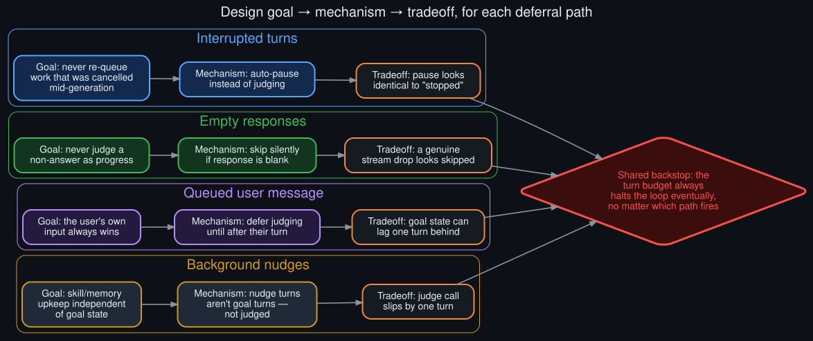

# Technical rationale: why the hook is built this way

  

Each deferral path traced back to the design goal it protects, and the tradeoff it accepts in exchange.

It would be easy to read the [four deferral paths](../README.md#root-cause-four-silent-deferral-paths)
as bugs. They aren't — each one is a deliberate, defensible design choice, made to protect a
specific failure mode that would be worse than the one it causes. This doc traces each path back
to the design goal behind it.

## Interrupted turns → auto-pause, not judge

**Design goal:** never let a cancelled or force-closed generation get judged as if it were a
completed turn. A partial response — cut off mid-sentence, mid-tool-call — is not evidence of
anything about the goal's progress. Judging it anyway would almost always produce a `continue`
verdict, because partial output rarely *looks* finished, and that `continue` would re-queue
essentially the same prompt that just got interrupted — a busy-loop on a cancelled turn.

**Mechanism:** the post-turn hook checks an interruption flag before doing anything else. If set,
it pauses the goal (recoverable via `/goal resume`) and returns immediately — no judge call.

**Tradeoff accepted:** a pause looks, from the outside, identical to "the loop just stopped."
There's no separate signal distinguishing "auto-paused because interrupted" from "silently
stuck" unless you check `/goal status` or the log. See [`howto.md`](howto.md) for how to tell
them apart in practice.

## Empty responses → skip silently

**Design goal:** never judge a non-answer as if it were progress. An empty or whitespace-only
response is symptomatic of a transient failure — an API error, a dropped stream — not of the
agent having nothing useful to say (a genuinely empty *intentional* response essentially never
happens; the model always says something).

**Mechanism:** before calling the judge, the hook checks whether the last assistant response,
stripped, is non-empty. If it's empty, return immediately.

**Tradeoff accepted:** this mirrors the same fail-open philosophy used elsewhere in the loop (see
below), but it means a genuine stream drop and a "nothing happened this turn" both look the same
from outside: nothing logged, nothing judged.

## Queued real user message → defer to the user's turn

**Design goal:** the user's own input should always take priority over an automated continuation.
If a user has typed something while the loop is running, judging the just-finished turn and
queuing a continuation prompt would race the user's message — worse, it could land the
continuation prompt *ahead* of what the user actually wanted to say next.

**Mechanism:** the hook peeks at the pending-input queue; if there's a real (non-slash-command)
message already waiting, it defers judging until after that message's turn runs. Slash commands
are excluded from this check deliberately — otherwise a queued `/subgoal` would silently stall the
loop waiting for a "real message" that will never come, since slash commands dispatch through a
different code path entirely.

**Tradeoff accepted:** goal state can visibly lag one turn behind the conversation whenever the
user is actively typing alongside an autonomous loop.

## Background-review nudges → not a goal turn, don't judge it

**Design goal:** skill-library and memory maintenance should run on their own schedule,
independent of whatever `/goal` happens to be doing. Coupling them would mean either the nudge
logic needs to know about goals, or the goal logic needs to know about nudges — added coupling
between two features that are otherwise fully independent.

**Mechanism:** the hook only judges turns that were themselves goal continuations. An injected
nudge turn doesn't carry that marker, so it's invisible to the goal judge entirely — not skipped
as a special case, just never in scope to begin with.

**Tradeoff accepted:** this is the one covered in most depth in [`catch22.md`](catch22.md) — the
judge call effectively slips by one turn every time a nudge lands mid-loop, and there's currently
no cross-awareness between the two schedulers to prevent it.

## The shared backstop

All four paths share one property: none of them can wedge the loop indefinitely. The **turn
budget** (default 20 continuation turns) is the actual backstop — regardless of how many turns get
silently deferred, the loop always terminates into an explicit `⏸ Goal paused — N/N turns used`
once the budget's exhausted. Every deferral path here is a *local* fail-open choice; the turn
budget is the *global* one. See [`known_unknowns.md`](known_unknowns.md) for what isn't yet
confirmed about how these interact at scale.
