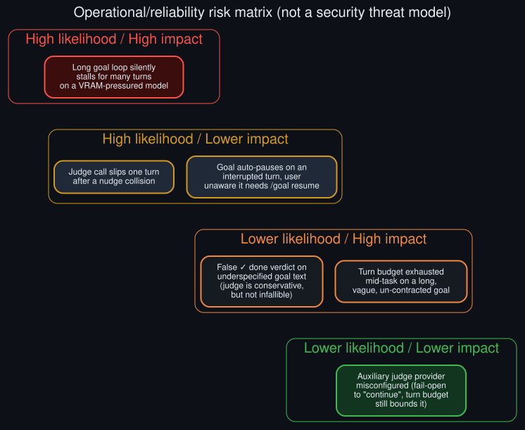

# Threat model (operational/reliability risk, not security)

  

A likelihood-times-impact framing of what can actually go wrong — reliability risk, not an adversarial security model.

**A note on the title:** this is not a security threat model. Nothing in this repo involves an
adversary, an attack surface, or a trust boundary being crossed. "Threat model" is used here in
its broader engineering sense — a structured accounting of what can go wrong operationally, and
how bad it is when it does — because that framing is useful even for a purely local, single-user
reliability question like this one.

## High likelihood / High impact

**A long goal loop silently stalls for many turns on a VRAM-pressured model.** This is the
headline finding of this repo: the dominant model observed accounts for the large majority of
both interrupted turns and reasoning-only stalls, and each one can trigger a deferral. Stacked
across a long loop, this is the single biggest source of "the goal loop looks broken" reports.
Mitigation: see [`future_directions.md`](future_directions.md)'s near-term measurement proposal.

## High likelihood / Lower impact

**A judge call slips one turn after a nudge collision.** Common (see the README's log evidence)
but self-correcting — the continuation resumes on the very next turn boundary. Annoying if you're
watching closely; invisible if you're not.

**A goal auto-pauses on an interrupted turn, and the user doesn't realize it needs `/goal
resume`.** Also common, and the impact is bounded (the goal just waits, indefinitely, for the
explicit resume) but it can look identical to "the feature stopped working" to someone who
doesn't check `/goal status`. See [`howto.md`](howto.md).

## Lower likelihood / High impact

**A false `done` verdict on an underspecified goal.** The judge is deliberately conservative — see
[`technical_rationale.md`](technical_rationale.md) — which makes this rarer than the reverse
(false `continue`), but it's not impossible on genuinely ambiguous goal text. Impact is high
because it silently ends the loop on work the user considers unfinished. A completion contract
with a concrete `verification` field is the direct mitigation.

**Turn budget exhausted mid-task on a long, vague, un-contracted goal.** Not silent — it produces
an explicit `⏸ Goal paused — N/N turns used` message — but can still surprise a user who expected
the loop to run indefinitely. Mitigated by setting a higher budget for genuinely long tasks, or by
tightening the goal text so the judge converges on `done` sooner.

## Lower likelihood / Lower impact

**Auxiliary judge provider misconfigured.** One real instance of this was found in an older log
window (an unresolvable provider with no fallback chain configured), but it appears already
resolved by an explicit provider pin added to config since, and the turn budget backstop bounds
the impact regardless — a misconfigured judge fails open to `continue`, never silently wedging the
loop, just running it to the budget instead of judging it properly along the way.

## What isn't in this matrix

Anything requiring an adversarial actor, a network boundary, or a trust decision — this repo's
scope is entirely about a single local user's own automated loop behaving unexpectedly, not about
anyone else's access to or influence over it.
