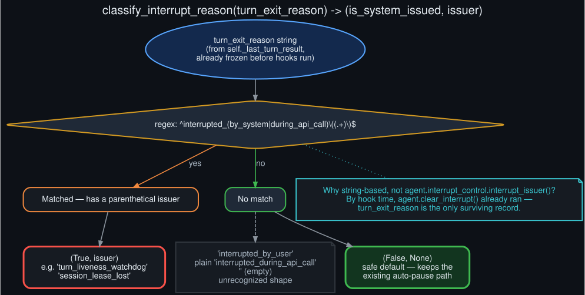

# turn_exit_reason classification

  

The fix's smallest and most load-bearing piece is a pure function,
`hermes_cli.goals.classify_interrupt_reason(turn_exit_reason: str) -> (bool, str | None)`. It
regex-matches exactly the two shapes `agent/turn_iteration_prep.py` already builds when a turn
ends on an interrupt:

- `interrupted_by_system(<issuer>)`
- `interrupted_during_api_call(<issuer>)`

Both come from `agent.interrupt_control.interrupt_issuer()`, which returns `None` for anything in
`USER_INTERRUPT_REASONS` (a real Ctrl+C, an explicit stop) and a slug — `turn_liveness_watchdog`,
`session_lease_lost`, and a few others — for every system-issued producer (`turn_facade_lease.py`'s
lease-loss and watchdog-stall paths, gateway request-timeout and shutdown paths, subagent
cancellation). A bare `interrupted_by_user`, a plain `interrupted_during_api_call` with no
parenthetical, an empty string, or anything unrecognized all classify as user-issued — the
deliberately conservative default, so an unfamiliar shape falls back to the existing safe
auto-pause rather than a new, less-tested retry path.

It's implemented as a plain string match rather than importing `interrupt_issuer` directly for a
specific reason: by the time `_maybe_continue_goal_after_turn` runs, `agent.clear_interrupt()` has
already fired and the live interrupt-reason state on the agent object is gone. `turn_exit_reason`
is a value frozen onto `turn.result` at turn-finalization time (`agent/turn_finalizer.py`) and
already copied onto `self._last_turn_result` before any post-turn hook executes
(`hermes_cli/cli_chat_turn_mixin.py`) — it's the one reliable record left to classify against.

Tested with a straightforward parametrized table covering every known shape plus the fallback
cases (`tests/hermes_cli/test_goals.py::test_classify_interrupt_reason`), and exercised
end-to-end via synthetic `turn_exit_reason` values in
`tests/hermes_cli/test_cli_goal_interrupt.py` rather than needing a live watchdog trip to
reproduce.
