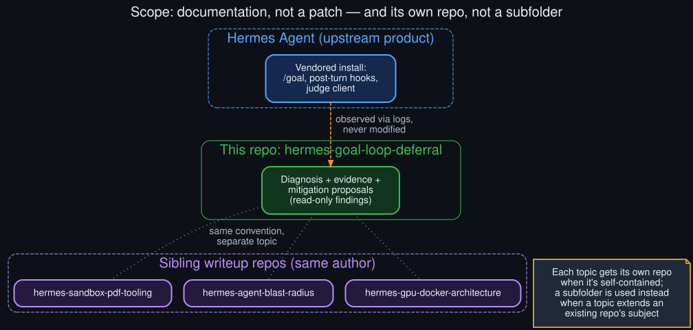

# Why this repo exists

  

This repo documents observed behavior; it doesn't modify the product it's documenting.

Two questions worth answering explicitly, since neither is obvious from the README alone.

## Why documentation, and not a patch?

Everything in this repo comes from reading Hermes Agent's own logs and its own source code —
observing what it does, not changing what it does. That's a deliberate scope boundary, for a
simple reason: the actual fix belongs upstream, in the maintained product, evaluated by the people
who own the tradeoffs documented in [`technical_rationale.md`](technical_rationale.md). A
local patch here would drift from upstream the moment the hook's logic changes, and would give
readers a false sense that the problem is "fixed" rather than "understood and reported."

What this repo *is*: a complete, sourced diagnosis — the symptom, the mechanism, the evidence,
and a set of concrete mitigation proposals in [`future_directions.md`](future_directions.md) —
that anyone hitting the same behavior can use immediately, and that could inform an actual
upstream change without requiring anyone to re-derive it from scratch.

## Why its own repo, and not a subfolder of an existing one?

The author publishes a series of standalone technical writeups, each documenting one real
incident or diagnosis against a specific local system. Some of those write-ups get folded into an
existing repo as a growing subfolder, when the new material extends that repo's existing subject —
for example, a related architecture repo that already covers the surrounding infrastructure keeps
growing new numbered diagram sets as more of that infrastructure gets documented.

This diagnosis doesn't extend an existing repo's subject — it's a self-contained investigation
into one specific behavior (`/goal`'s post-turn judging), with its own evidence, its own
diagrams, and its own scope. The precedent for *both* patterns exists across the author's other
repos; the rule of thumb is whether the new material is "more of X" (→ subfolder of the X repo)
or "a new, complete X" (→ new repo). This is the latter.

## What "sourced" means here

Every specific claim in this repo — the deferral paths, the log excerpts, the per-model
interruption counts — was read directly out of real `agent.log` output during an active
investigation, not reconstructed from memory or generalized from a single incident. Model names
and config key names are kept precise and real; only local paths, hostnames, and session
identifiers were stripped for publication, since they carry no diagnostic value for a public
reader and do carry unnecessary personal information. See
[`known_unknowns.md`](known_unknowns.md) for the places where the evidence runs out and the
diagnosis becomes informed inference rather than direct observation.
